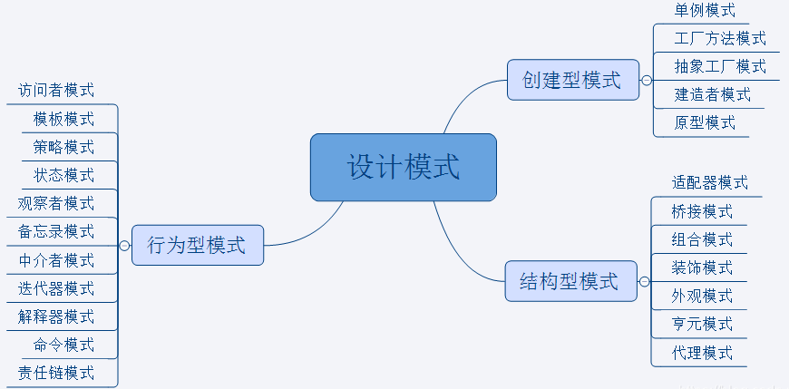
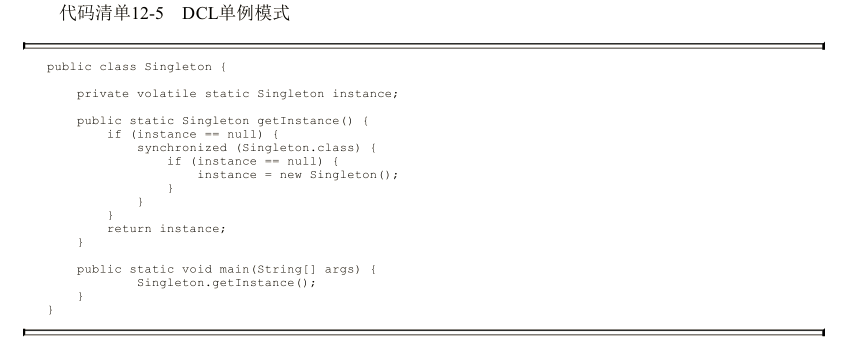





## 问题思考

> - [X] 说一说常用的设计模式，如何实现一个线程安全的单例模式。
> - [X] 单例模式有哪几种实现方式，**饿汉式**单例模式和**懒汉式**单例模式的区别以及代码实现。
> - [X] **双重校验**单例模式为什么需要加两层校验，为什么要使用 volatile 关键字，不使用 volatile 关键字会导致线程不安全吗。
> - [X] 使用了 synchronized 为什么还需要使用 volatile，使用 synchronized 的作用是什么。

## 单例模式

> 定义：保证一个类仅有一个实例，并提供一个访问它的全局访问点。
>
> 特点：
>
> 1. 单例模式只能有一个实例。
> 2. 单例类必须创建自己的唯一实例。
> 3. 单例类必须向其他对象提供这一实例。

## 单例模式的分类

> 饿汉式单例模式：立即加载
>
> 懒汉式单例模式：延迟加载

## 如何实现一个线程安全的单例模式

> 《Effective Java》第 3 条：用私有构造器或者枚举类型强化 Singleton 属性。
>
> 实现线程安全的单例模式需要防止反射、防止反序列化、防止 clone。

```java
public class Singleton implements Serializable, Cloneable {
    // 使用 volatile 禁止指令重排序
    private volatile static Singleton instance = null;

    // 私有化构造方法
    private Singleton() {
        // 防止反射
        if (instance != null) {
            throw new RuntimeException("单例模式不允许重复创建对象");
        }
    }

    public static Singleton getInstance() {
        if (instance == null) {
            synchronized (Singleton.class) {
                if (instance == null) {
                    instance = new Singleton();
                }
            }
        }
        return instance;
    }

    // 防止 clone
    @Override
    protected Object clone() throws CloneNotSupportedException {
        return instance;
    }

    // 防止反序列化
    private Object readResolve() {
        return instance;
    }
}
```

> 1. 防止反序列化需要实现 Serializable 接口并且重写 readResolve() 方法。
> 2. 防止 clone 需要实现 Cloneable 接口并且覆盖 Object 类的 clone() 方法。
> 3. 防止反射可以通过在构造方法中做判断，让它在被要求创建第二个实例的时候抛出异常。

## 单例模式的七种实现方式(线程安全)

### 一、懒汉式-双重校验单例模式



### 二、懒汉式-静态内部类单例模式

```java
public class Singleton {
    private static class SingletonHolder {
        private static final Singleton INSTANCE = new Singleton();
    }

    private Singleton() {
    }

    public static Singleton getInstance() {
        return SingletonHolder.INSTANCE;
    }
}
```

### 三、懒汉式-同步代码块单例模式

```java
public class Singleton {
    private static Singleton instance = null;

    private Singleton() {
    }

    public static Singleton getInstance() {
        synchronized (Singleton.class) {
            if (instance == null) {
                instance = new Singleton();
            }
            return instance;
        }
    }
}
```

### 四、懒汉式-同步方法单例模式

```java
public class Singleton {
    private static Singleton instance = null;

    private Singleton() {
    }

    public synchronized static Singleton getInstance() {
        if (instance == null) {
            instance = new Singleton();
        }
        return instance;
    }
}
```

### 五、饿汉式-静态代码块单例模式

```java
public class Singleton {
    private static Singleton instance = null;

    static {
        instance = new Singleton();
    }

    private Singleton() {
    }

    public static Singleton getInstance() {
        return instance;
    }
}
```

### 六、饿汉式-静态常量单例模式

```java
public class Singleton {
    private static final Singleton SINGLETON = new Singleton();

    private Singleton() {
    }

    public static Singleton getSingleton() {
        return SINGLETON;
    }
}
```

### 七、枚举类单例模式

```java
public enum Singleton {
    INSTANCE
}

class Test {
    public static void main(String[] args) {
        Singleton instance1 = Singleton.INSTANCE;
        Singleton instance2 = Singleton.INSTANCE;
        System.out.println(instance1 == instance2);
    }
}
```

> 这种方法在功能上与静态常量单例模式相似，但更加简洁，无偿地提供了序列化机制，绝对防止多次实例化，即使是在面对复杂的序列化或者反射攻击的时候。
>
> 虽然这种方法还没有广泛采用，但是**单元素的枚举类型经常成为实现 Singleton 的最佳方法**。
>
> **注意：** 如果 Singleton 必须扩展一个超类，而不是扩展 Enum 的时候，则不宜使用这个方法（虽然可以声明枚举去实现接口）。

## 单例模式在 JDK 中的应用

> * [X] java.lang.Runtime#getRuntime()
> * [X] java.awt.Desktop#getDesktop()
> * [X] java.lang.System#getSecurityManager()

## 参考资料

- [如何正确地写出单例模式](http://wuchong.me/blog/2014/08/28/how-to-correctly-write-singleton-pattern/)
- [https://coolshell.cn/articles/265.html](https://coolshell.cn/articles/265.html)
