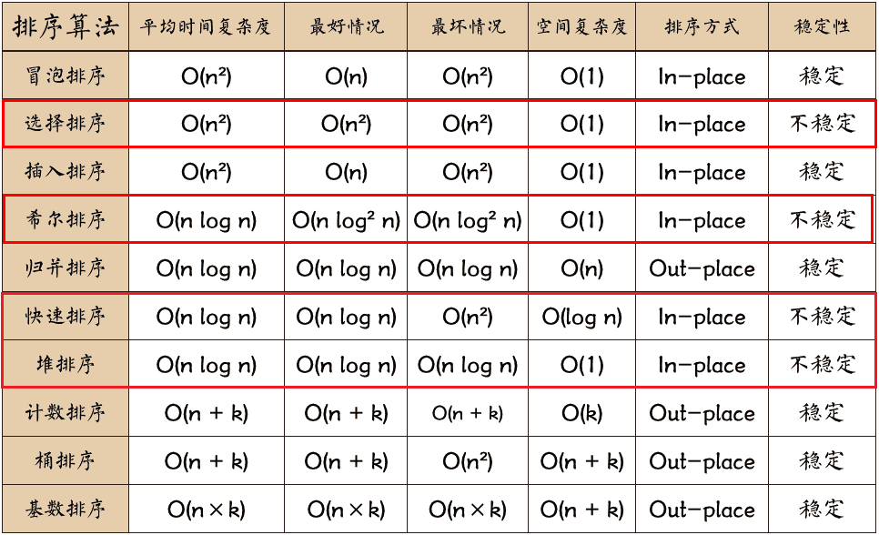
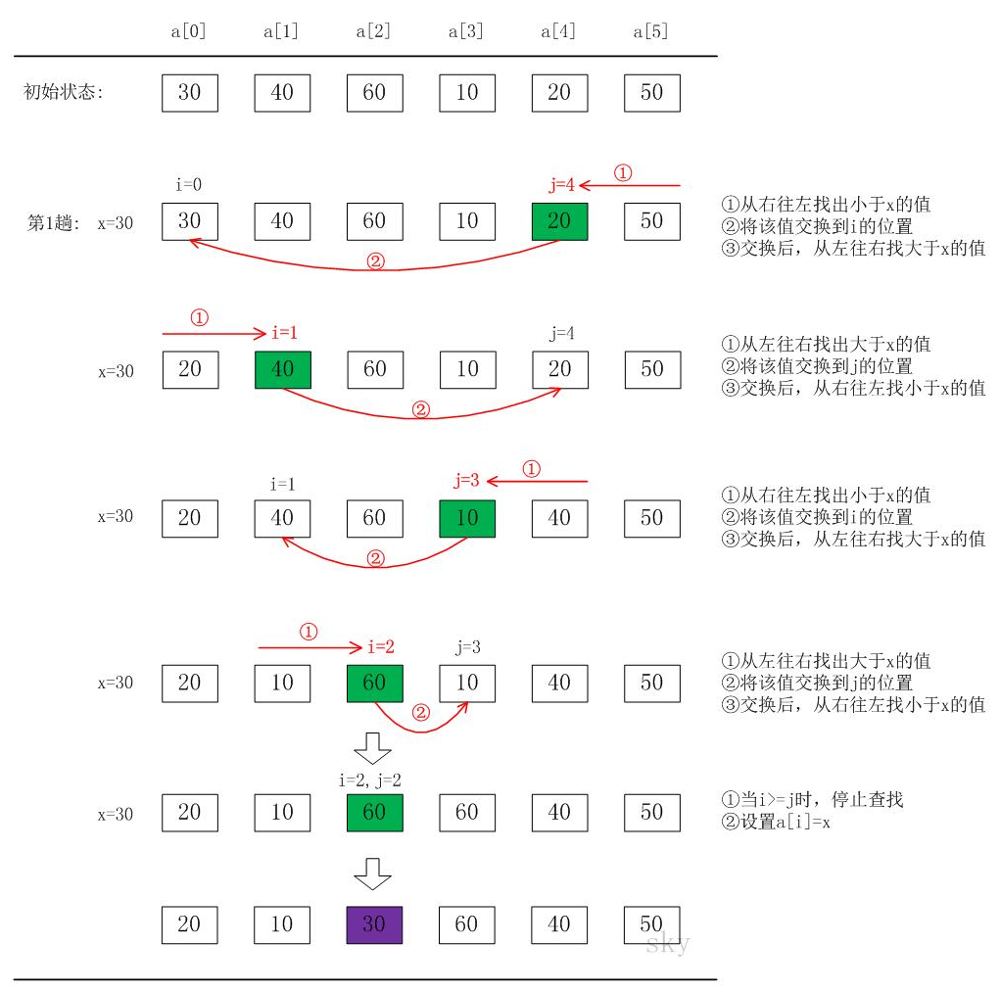
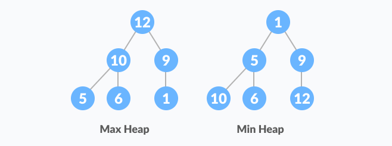
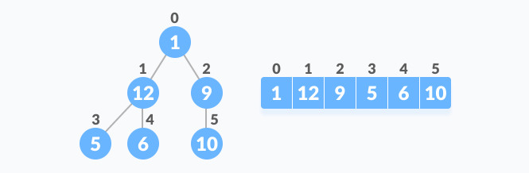
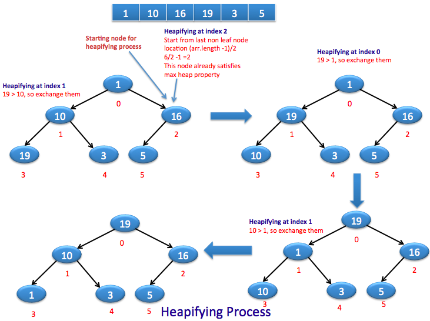
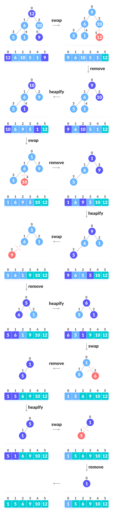



## 十大经典排序算法



> 不稳定的排序算法有：**快希选堆**
>
> - [x] 快速排序
>
> - [x] 希尔排序
>
> - [x] 选择排序
>
> - [x] 堆排序
>

## 冒泡排序

```java
public class BubbleSort {
    public int[] sortArray(int[] nums) {
        if (nums == null || nums.length < 2) {
            return nums;
        }
        bubbleSort(nums);
        return nums;
    }

    // 冒泡排序
    private void bubbleSort(int[] nums) {
        if (nums == null || nums.length < 2) {
            return;
        }
        int n = nums.length;
        boolean flag;
        for (int i = 0; i < n - 1; i++) {
            flag = true;
            for (int j = 0; j < n - 1 - i; j++) {
                if (nums[j] > nums[j + 1]) {
                    swap(nums, j, j + 1);
                    flag = false;
                }
            }
            if (flag) {
                break;
            }
        }
    }

    private void swap(int[] nums, int i, int j) {
        int temp = nums[i];
        nums[i] = nums[j];
        nums[j] = temp;
    }
}
```

## 选择排序

```java
public class SelectionSort {
    public int[] sortArray(int[] nums) {
        if (nums == null || nums.length < 2) {
            return nums;
        }
        selectionSort(nums);
        return nums;
    }

    // 选择排序
    private void selectionSort(int[] nums) {
        if (nums == null || nums.length < 2) {
            return;
        }
        int n = nums.length;
        for (int i = 0; i < n - 1; i++) {
            int minIndex = i;
            for (int j = i + 1; j < n; j++) {
                if (nums[j] < nums[minIndex]) {
                    minIndex = j;
                }
            }
            if (minIndex != i) {
                swap(nums, minIndex, i);
            }
        }
    }

    private void swap(int[] nums, int i, int j) {
        int temp = nums[i];
        nums[i] = nums[j];
        nums[j] = temp;
    }
}
```

## 插入排序

```java
public class InsertionSort {
    public int[] sortArray(int[] nums) {
        if (nums == null || nums.length < 2) {
            return nums;
        }
        insertionSort(nums);
        return nums;
    }

    // 插入排序
    private void insertionSort(int[] nums) {
        if (nums == null || nums.length < 2) {
            return;
        }
        for (int i = 1; i < nums.length; i++) {
            int temp = nums[i];
            int j = i;
            while (j > 0 && temp < nums[j - 1]) {
                nums[j] = nums[j - 1];
                j--;
            }
            if (j != i) {
                nums[j] = temp;
            }
        }
    }
}
```

## 归并排序

```java
class Solution {
    public int[] sortArray(int[] nums) {
        if (nums == null || nums.length <= 1) {
            return nums;
        }
        mergeSort(nums, 0, nums.length - 1);
        return nums;
    }

    public void mergeSort(int[] nums, int left, int right) {
        if (left >= right) {
            return;
        }
        int mid = left + (right - left) / 2;
        mergeSort(nums, left, mid);
        mergeSort(nums, mid + 1, right);
        merge(nums, left, mid, right);
    }

    public void merge(int[] nums, int left, int mid, int right) {
        int[] res = new int[right - left + 1];
        int p = 0, p1 = left, p2 = mid + 1;
        while (p1 <= mid && p2 <= right) {
            if (nums[p1] < nums[p2]) {
                res[p] = nums[p1];
                p1++;
            } else {
                res[p] = nums[p2];
                p2++;
            }
            p++;
        }
        while (p1 <= mid) {
            res[p] = nums[p1];
            p1++;
            p++;
        }
        while (p2 <= right) {
            res[p] = nums[p2];
            p2++;
            p++;
        }
        System.arraycopy(res, 0, nums, left, res.length);
    }
}
```

```go
func sortArray(nums []int) []int {
	return mergeSort(nums)
}

func mergeSort(nums []int) []int {
	if len(nums) <= 1 {
		return nums
	}
	mid := len(nums) / 2
	left := mergeSort(nums[:mid])
	right := mergeSort(nums[mid:])
	return merge(left, right)
}

func merge(left, right []int) []int {
	res := make([]int, 0, len(left)+len(right))
	p1, p2 := 0, 0
	for p1 < len(left) || p2 < len(right) {
		if p1 == len(left) {
			res = append(res, right[p2:]...)
			return res
		}
		if p2 == len(right) {
			res = append(res, left[p1:]...)
			return res
		}
		if left[p1] < right[p2] {
			res = append(res, left[p1])
			p1++
		} else {
			res = append(res, right[p2])
			p2++
		}
	}
	return res
}
```

## 快速排序

```java
public class QuickSort {
    public int[] sortArray(int[] nums) {
        if (nums == null || nums.length < 2) {
            return nums;
        }
        quickSort(nums, 0, nums.length - 1);
        return nums;
    }

    // 快速排序
    private void quickSort(int[] nums, int left, int right) {
        if (left >= right) return;
        int index = (int) (Math.random() * (right - left + 1)) + left;
        swap(nums, index, left);
        int i = left, j = right; // 左右指针
        int point = nums[left]; // 第一个元素作为基准点
        // i == j 的时候退出循环, 此时这个位置存放基准点
        while (i < j) {
            while (i < j && nums[j] > point) j--;
            if (i < j) nums[i++] = nums[j];
            while (i < j && nums[i] < point) i++;
            if (i < j) nums[j--] = nums[i];
        }
        nums[i] = point; // 或者 nums[j] = point, 此时 i == j, 基准点存放的位置
        quickSort(nums, left, i - 1); // 递归左半部分
        quickSort(nums, i + 1, right); // 递归右半部分
    }

    private void swap(int[] nums, int i, int j) {
        int temp = nums[i];
        nums[i] = nums[j];
        nums[j] = temp;
    }
}
```

```go
func sortArray(nums []int) []int {
	if len(nums) <= 1 {
		return nums
	}
	quickSort(nums, 0, len(nums)-1)
	return nums
}

func quickSort(nums []int, left int, right int) {
	if left >= right {
		return
	}
	i, j := left, right
	point := nums[left]
	for i < j {
		for i < j && nums[j] > point {
			j--
		}
		if i < j {
			nums[i] = nums[j]
			i++
		}
		for i < j && nums[i] < point {
			i++
		}
		if i < j {
			nums[j] = nums[i]
			j--
		}
	}
	nums[i] = point
	quickSort(nums, left, i-1)
	quickSort(nums, i+1, right)
}
```



## 堆排序

> 堆是具有以下性质的完全二叉树：
>
> 每个结点的值都大于或等于其左右孩子结点的值，称为**大顶堆**；
>
> 或者每个结点的值都小于或等于其左右孩子结点的值，称为**小顶堆**。



```java
public class HeapSort {
    public int[] sortArray(int[] nums) {
        if (nums == null || nums.length < 2) {
            return nums;
        }
        heapSort(nums);
        return nums;
    }

    // 堆排序
    private void heapSort(int[] nums) {
        if (nums == null || nums.length < 2) {
            return;
        }
        for (int i = nums.length / 2 - 1; i >= 0; i--) {
            shiftHeap(nums, i, nums.length);
        }
        for (int j = nums.length - 1; j > 0; j--) {
            swap(nums, 0, j);
            shiftHeap(nums, 0, j);
        }
    }

    // 调整一个数组为大顶推(升序)
    private void shiftHeap(int[] nums, int k, int len) {
        while (2 * k + 1 < len) {
            int j = 2 * k + 1;
            if (j + 1 < len && nums[j + 1] > nums[j]) j++;
            if (nums[k] >= nums[j]) break;
            swap(nums, k, j);
            k = j;
        }
    }

    private void swap(int[] nums, int i, int j) {
        int temp = nums[i];
        nums[i] = nums[j];
        nums[j] = temp;
    }
}
```

### 构造初始堆



### 堆排序过程图解





## LeetCode 排序经典题目

- [x] [912. 排序数组](https://leetcode-cn.com/problems/sort-an-array/)
- [x] [88. 合并两个有序数组](https://leetcode-cn.com/problems/merge-sorted-array/)
- [x] [21. 合并两个有序链表](https://leetcode-cn.com/problems/merge-two-sorted-lists/)
- [x] [148. 排序链表](https://leetcode.cn/problems/sort-list/)

### [912. 排序数组](https://leetcode.cn/problems/sort-an-array/)

```go
write your code here
```

### [88. 合并两个有序数组](https://leetcode.cn/problems/merge-sorted-array/)

```go
write your code here
```

### [21. 合并两个有序链表](https://leetcode.cn/problems/merge-two-sorted-lists/)

```go
write your code here
```

### [148. 排序链表](https://leetcode.cn/problems/sort-list/)

```go
write your code here
```

## 参考资料

- [https://www.programiz.com/dsa/heap-sort](https://www.programiz.com/dsa/heap-sort)
- [https://sort.hust.cc/](https://sort.hust.cc/)
- [https://www.cnblogs.com/wmyskxz/p/9301021.html](https://www.cnblogs.com/wmyskxz/p/9301021.html)
- [https://www.cnblogs.com/skywang12345/p/3596746.html](https://www.cnblogs.com/skywang12345/p/3596746.html)
