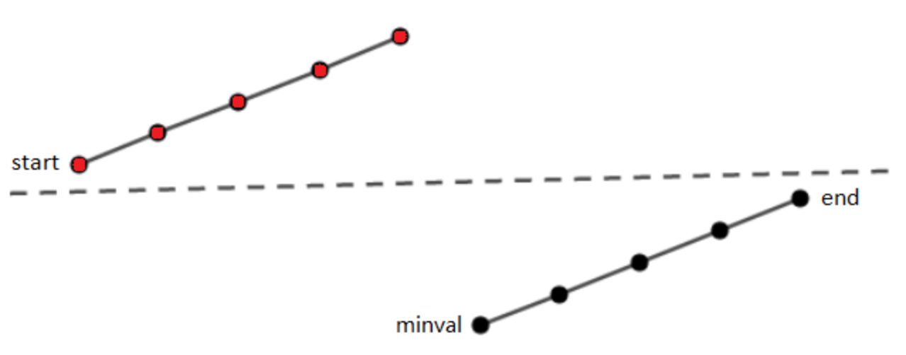



## 二分查找的分类

> - [X] 基本的二分查找
> - [X] 等于给定值的第一个元素和最后一个元素
> - [X] **旋转排序数组的二分查找**
> - [X] 小于等于给定值的第一个元素
> - [X] 大于等于给定值的第一个元素

## 基本的二分查找

### [704. 二分查找](https://leetcode-cn.com/problems/binary-search/)

```go
func search(nums []int, target int) int {
    left, right := 0, len(nums) - 1
    for left <= right {
        mid := left +(right - left)/2
        if nums[mid] == target {
            return mid
        } else if nums[mid] > target {
            right = mid - 1
        } else {
            left = mid + 1
        }
    }
    return -1
}
```

## 等于给定值的第一个元素和最后一个元素

### [34. 在排序数组中查找元素的第一个和最后一个位置](https://leetcode-cn.com/problems/find-first-and-last-position-of-element-in-sorted-array/)

```java
class Solution {
    public int[] searchRange(int[] nums, int target) {
        int left = searchLeft(nums, target);
        int right = searchRight(nums, target);
        return new int[]{left, right};
    }

    public int searchLeft(int[] nums, int target) {
        int left = 0, right = nums.length - 1;
        int first = -1;
        while (left <= right) {
            int mid = left + (right - left) / 2;
            if (nums[mid] > target) {
                right = mid - 1;
            } else if (nums[mid] < target) {
                left = mid + 1;
            } else {
                first = mid;
                right = mid - 1;
            }
        }
        return first;
    }

    public int searchRight(int[] nums, int target) {
        int left = 0, right = nums.length - 1;
        int last = -1;
        while (left <= right) {
            int mid = left + (right - left) / 2;
            if (nums[mid] > target) {
                right = mid - 1;
            } else if (nums[mid] < target) {
                left = mid + 1;
            } else {
                last = mid;
                left = mid + 1;
            }
        }
        return last;
    }
}
```

### [剑指 Offer 53 - I. 在排序数组中查找数字 I](https://leetcode.cn/problems/zai-pai-xu-shu-zu-zhong-cha-zhao-shu-zi-lcof/)

```go
write your code here
```

## 旋转排序数组的二分查找

### [33. 搜索旋转排序数组](https://leetcode-cn.com/problems/search-in-rotated-sorted-array/)



```go
write your code here
```

### [81. 搜索旋转排序数组 II](https://leetcode.cn/problems/search-in-rotated-sorted-array-ii/)

> **注意：数组可能包含重复元素**

```go
write your code here
```

### [面试题 10.03. 搜索旋转数组](https://leetcode.cn/problems/search-rotate-array-lcci/)

```go
write your code here
```

### [153. 寻找旋转排序数组中的最小值](https://leetcode-cn.com/problems/find-minimum-in-rotated-sorted-array/)

```go
write your code here
```

### [154. 寻找旋转排序数组中的最小值 II](https://leetcode.cn/problems/find-minimum-in-rotated-sorted-array-ii/)

> **注意：数组可能包含重复元素**

```go
write your code here
```

### [剑指 Offer 11. 旋转数组的最小数字](https://leetcode.cn/problems/xuan-zhuan-shu-zu-de-zui-xiao-shu-zi-lcof/)

> **注意：本题与主站 154 题相同**

## 二分查找经典题目

> - [ ] [154. 寻找旋转排序数组中的最小值 II](https://leetcode.cn/problems/find-minimum-in-rotated-sorted-array-ii/)
> - [X] [面试题 10.03. 搜索旋转数组](https://leetcode.cn/problems/search-rotate-array-lcci/)
> - [X] **百度面试题-有序数组中绝对值最小的元素**
> - [X] [540. 有序数组中的单一元素](https://leetcode.cn/problems/single-element-in-a-sorted-array/)
> - [X] [278. 第一个错误的版本](https://leetcode-cn.com/problems/first-bad-version/)
> - [ ] [744. 寻找比目标字母大的最小字母](https://leetcode-cn.com/problems/find-smallest-letter-greater-than-target/)
> - [ ] [162. 寻找峰值](https://leetcode-cn.com/problems/find-peak-element/)
> - [ ] [852. 山脉数组的峰顶索引](https://leetcode.cn/problems/peak-index-in-a-mountain-array/)

[35. 搜索插入位置](https://leetcode-cn.com/problems/search-insert-position/)

```go
write your code here
```

### 百度面试题-有序数组中绝对值最小的元素

```go
write your code here
```

### [540. 有序数组中的单一元素](https://leetcode.cn/problems/single-element-in-a-sorted-array/)

```java
write your code here
```

### [278. 第一个错误的版本](https://leetcode-cn.com/problems/first-bad-version/)

```go
write your code here
```

### [744. 寻找比目标字母大的最小字母](https://leetcode-cn.com/problems/find-smallest-letter-greater-than-target/)

```go
write your code here
```

### [162. 寻找峰值](https://leetcode-cn.com/problems/find-peak-element/)

```go
write your code here
```

### [852. 山脉数组的峰顶索引](https://leetcode-cn.com/problems/peak-index-in-a-mountain-array/)

```go
write your code here
```
