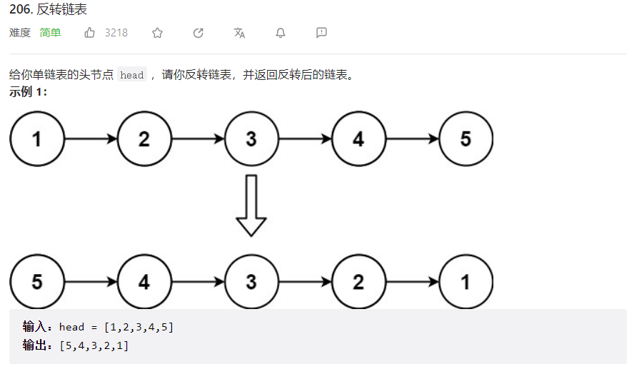
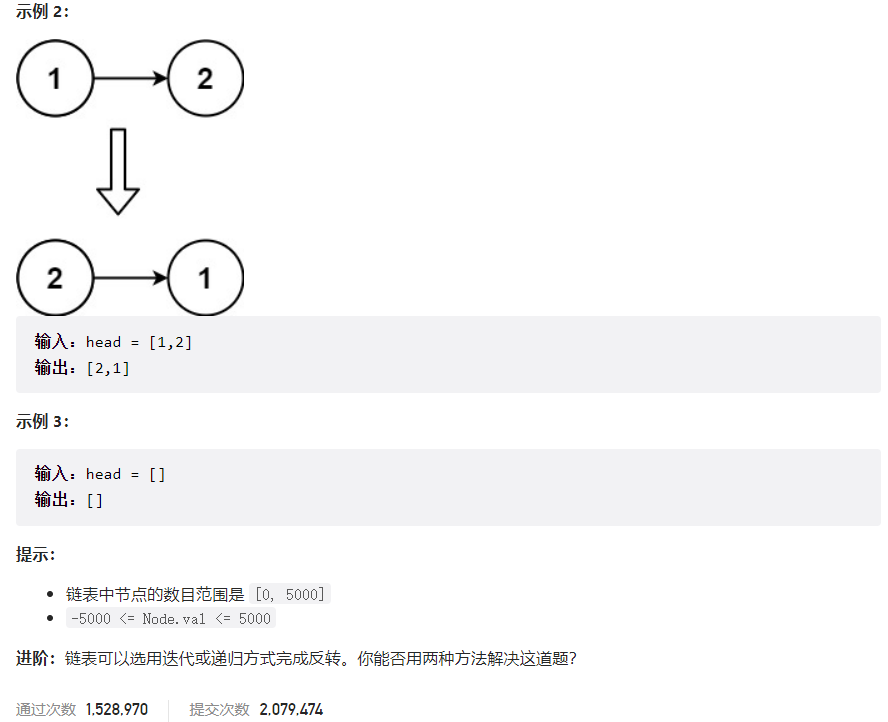
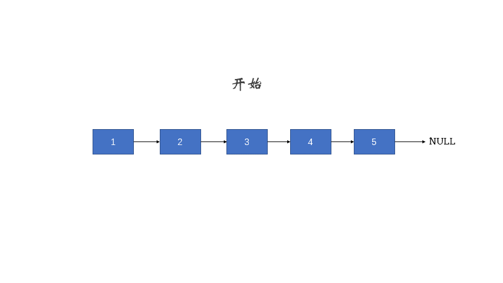



## 题目描述

> 🔥 [206. 反转链表](https://leetcode.cn/problems/reverse-linked-list/)





## 思路分析

> 1. 头插法
> 2. 递归



## 参考代码

```go
func reverseList(head *ListNode) *ListNode {
	if head == nil || head.Next == nil {
		return head
	}
	cur := head
	var pre *ListNode
	for cur != nil {
		next := cur.Next
		cur.Next = pre
		pre = cur
		cur = next
	}
	return pre
}
```

```go
func reverseList(head *ListNode) *ListNode {
	if head == nil || head.Next == nil {
		return head
	}
	newHead := reverseList(head.Next)
	head.Next.Next = head
	head.Next = nil
	return newHead
}
```

<a class="button show-hidden">🍏 点击查看 Java 题解(一)</a>

```java
public class Solution {
    public ListNode reverseList(ListNode head) {
        if (head == null || head.next == null) {
            return head;
        }
        ListNode pre = null;
        ListNode cur = head;
        while (cur != null) {
            ListNode next = cur.next;
            cur.next = pre;
            pre = cur;
            cur = next;
        }
        return pre;
    }
}
```

<a class="button show-hidden">🍏 点击查看 Java 题解(二)</a>

```java
public class Solution {
    public ListNode reverseList(ListNode head) {
        if (head == null || head.next == null) {
            return head;
        }
        ListNode newHead = reverseList(head.next);
        head.next.next = head;
        head.next = null;
        return newHead;
    }
}
```

## 相似题目

| 题目                                                         | 难度   | 题解                                        |
| ------------------------------------------------------------ | ------ | ------------------------------------------- |
| [反转链表 II](https://leetcode.cn/problems/reverse-linked-list-ii/) | Medium |                                             |
| [上下翻转二叉树](https://leetcode.cn/problems/binary-tree-upside-down/) | Medium |                                             |
| [回文链表](https://leetcode.cn/problems/palindrome-linked-list/) | Easy   | [🟢](https://hgnulb.github.io/blog/54516872) |
