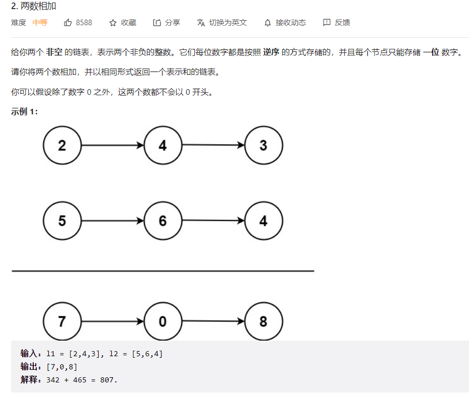
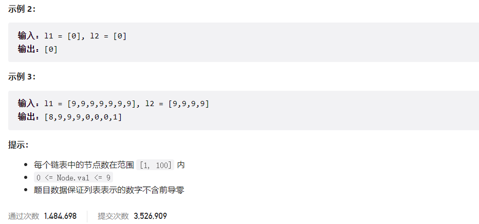



## 题目描述

> 🔥 [2. 两数相加](https://leetcode.cn/problems/add-two-numbers/)





## 思路分析

> 加法问题

## 参考代码

```go
func addTwoNumbers(l1 *ListNode, l2 *ListNode) *ListNode {
	if l1 == nil {
		return l2
	} else if l2 == nil {
		return l1
	}
	dummy := &ListNode{}
	cur := dummy
	carry := 0
	for l1 != nil || l2 != nil || carry > 0 {
		total := carry
		if l1 != nil {
			total += l1.Val
			l1 = l1.Next
		}
		if l2 != nil {
			total += l2.Val
			l2 = l2.Next
		}
		cur.Next = &ListNode{Val: total % 10}
		cur = cur.Next
		carry = total / 10
	}
	return dummy.Next
}
```

<a class="button show-hidden">🍏 点击查看 Java 题解</a>

```java
write your code here
```

## 相似题目

| 题目                                                         | 难度   | 题解 |
| ------------------------------------------------------------ | ------ | ---- |
| [字符串相乘](https://leetcode.cn/problems/multiply-strings/) | Medium |      |
| [二进制求和](https://leetcode.cn/problems/add-binary/) | Easy |      |
| [两整数之和](https://leetcode.cn/problems/sum-of-two-integers/) | Medium |      |
| [字符串相加](https://leetcode.cn/problems/add-strings/) | Easy |      |
| [两数相加 II](https://leetcode.cn/problems/add-two-numbers-ii/) | Medium |      |
| [数组形式的整数加法](https://leetcode.cn/problems/add-to-array-form-of-integer/) | Easy |      |
