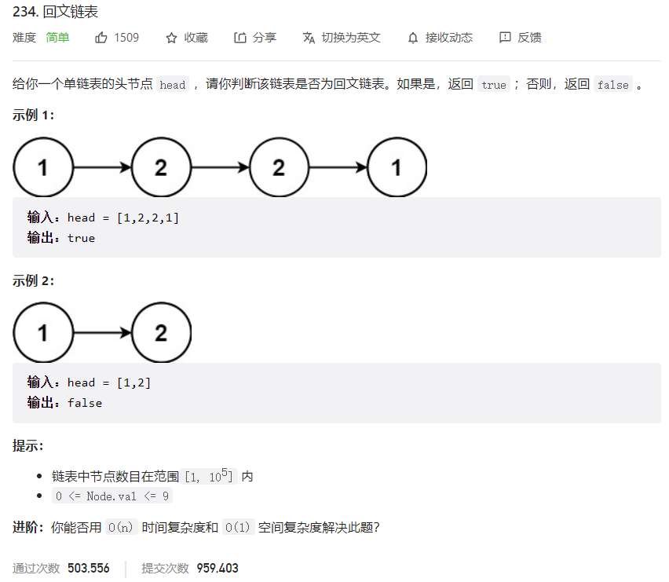



## 题目描述

> 🔥 [234. 回文链表](https://leetcode.cn/problems/palindrome-linked-list/)



## 思路分析

> 1. 获取链表的中间节点
> 2. 反转链表的后半部分
> 3. 比较

## 参考代码

```go
func isPalindrome(head *ListNode) bool {
	if head == nil || head.Next == nil {
		return true
	}
	slow, fast := head, head
	var pre *ListNode
	for fast != nil && fast.Next != nil {
		pre = slow
		slow = slow.Next
		fast = fast.Next.Next
	}
	pre.Next = nil
	l1, l2 := head, reverse(slow)
	for l1 != nil {
		if l1.Val != l2.Val {
			return false
		}
		l1 = l1.Next
		l2 = l2.Next
	}
	return true
}

func reverse(head *ListNode) *ListNode {
	if head == nil || head.Next == nil {
		return head
	}
	var pre *ListNode
	cur := head
	for cur != nil {
		node := cur.Next
		cur.Next = pre
		pre = cur
		cur = node
	}
	return pre
}
```

<a class="button show-hidden">🍏 点击查看 Java 题解</a>

```java
class Solution {
    public boolean isPalindrome(ListNode head) {
        if (head == null || head.next == null) {
            return true;
        }
        ListNode slow = head, fast = head;
        while (fast != null && fast.next != null) {
            slow = slow.next;
            fast = fast.next.next;
        }

        ListNode pre = null, cur = slow;
        while (cur != null) {
            ListNode next = cur.next;
            cur.next = pre;
            pre = cur;
            cur = next;
        }

        ListNode p1 = head, p2 = pre;
        while (p2 != null) {
            if (p1.val != p2.val) {
                return false;
            }
            p1 = p1.next;
            p2 = p2.next;
        }
        return true;
    }
}
```

## 相似题目

| 题目                                                         | 难度   | 题解 |
| ------------------------------------------------------------ | ------ | ---- |
| [回文数](https://leetcode.cn/problems/palindrome-number/) | Easy |      |
| [验证回文串](https://leetcode.cn/problems/valid-palindrome/) | Easy |      |
| [反转链表](https://leetcode.cn/problems/reverse-linked-list/) | Easy |      |
