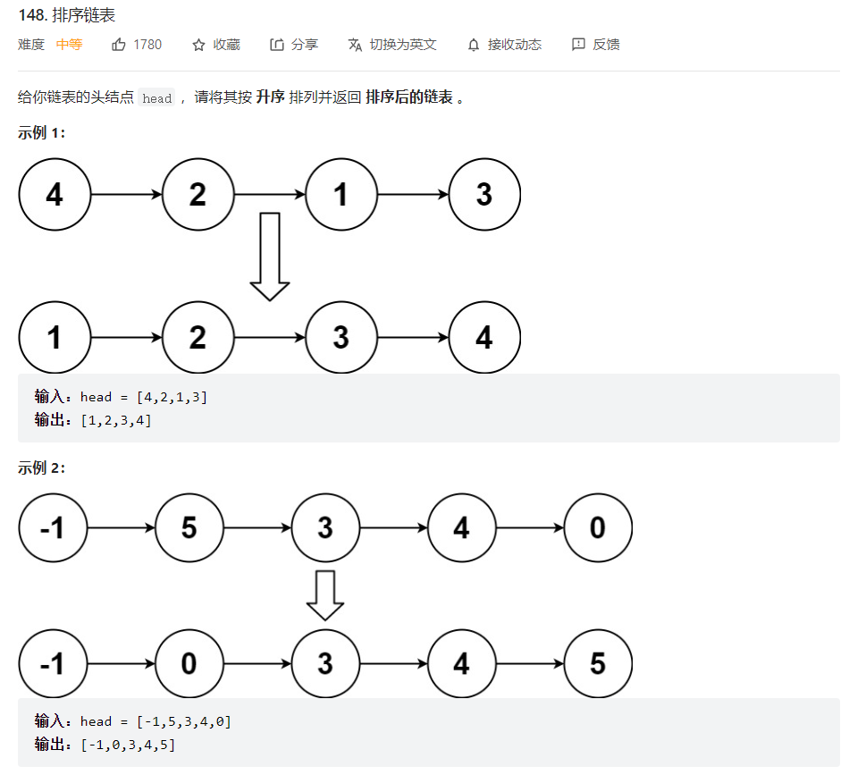
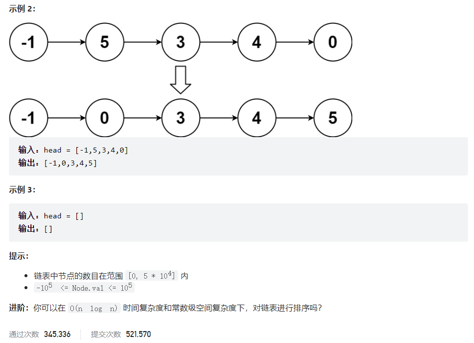
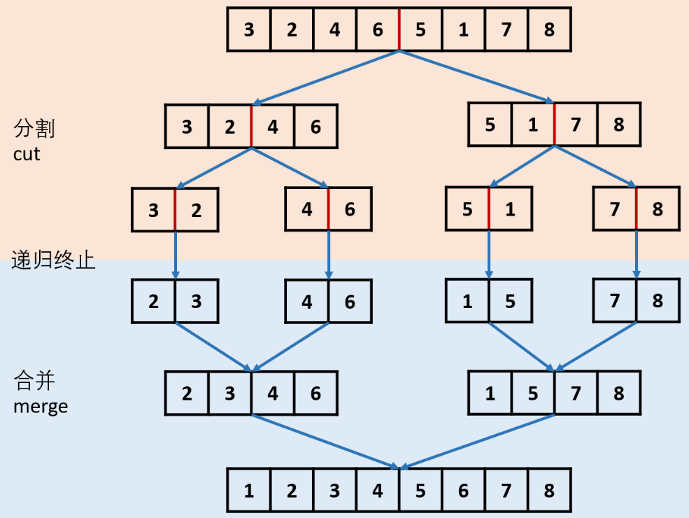



## 题目描述

> 🔥 [148. 排序链表](https://leetcode.cn/problems/sort-list/)





## 思路分析

> 1. 获取链表的中间节点，分割链表
> 2. 排序左右部分链表
> 3. 合并两个有序链表



## 参考代码

```go
func sortList(head *ListNode) *ListNode {
	if head == nil || head.Next == nil {
		return head
	}
	slow, fast := head, head
	preSlow := &ListNode{Next: head}
	for fast != nil && fast.Next != nil {
		fast = fast.Next.Next
		preSlow = slow
		slow = slow.Next
	}
	preSlow.Next = nil
	left := sortList(head)
	right := sortList(slow)
	return mergeTwoLists(left, right)
}

func mergeTwoLists(l1 *ListNode, l2 *ListNode) *ListNode {
	if l1 == nil {
		return l2
	} else if l2 == nil {
		return l1
	}
	if l1.Val < l2.Val {
		l1.Next = mergeTwoLists(l1.Next, l2)
		return l1
	} else {
		l2.Next = mergeTwoLists(l1, l2.Next)
		return l2
	}
}
```

```go
func sortList(head *ListNode) *ListNode {
	if head == nil || head.Next == nil {
		return head
	}
	slow, fast := head, head
	var pre *ListNode
	for fast != nil && fast.Next != nil {
		pre = slow
		slow = slow.Next
		fast = fast.Next.Next
	}
	pre.Next = nil

	l1 := sortList(head)
	l2 := sortList(slow)
	return mergeTwoLists(l1, l2)
}

func mergeTwoLists(l1 *ListNode, l2 *ListNode) *ListNode {
	if l1 == nil {
		return l2
	} else if l2 == nil {
		return l1
	}
	dummy := &ListNode{}
	cur := dummy
	for l1 != nil && l2 != nil {
		if l1.Val < l2.Val {
			cur.Next = l1
			l1 = l1.Next
		} else {
			cur.Next = l2
			l2 = l2.Next
		}
		cur = cur.Next
	}
	if l1 != nil {
		cur.Next = l1
	} else {
		cur.Next = l2
	}
	return dummy.Next
}
```

<a class="button show-hidden">🍏 点击查看 Java 题解</a>

```java
public class Solution {
    public ListNode sortList(ListNode head) {
        if (head == null || head.next == null) {
            return head;
        }
        ListNode preSlow = head, slow = head, fast = head;
        while (fast != null && fast.next != null) {
            preSlow = slow;
            slow = slow.next;
            fast = fast.next.next;
        }
        preSlow.next = null;
        ListNode l1 = sortList(head);
        ListNode l2 = sortList(slow);
        return mergeTwoLists(l1, l2);
    }

    public ListNode mergeTwoLists(ListNode l1, ListNode l2) {
        if (l1 == null || l2 == null) {
            return l1 == null ? l2 : l1;
        }
        if (l1.val < l2.val) {
            l1.next = mergeTwoLists(l1.next, l2);
            return l1;
        } else {
            l2.next = mergeTwoLists(l1, l2.next);
            return l2;
        }
    }
}
```

## 相似题目

| 题目                                                         | 难度   | 题解 |
| ------------------------------------------------------------ | ------ | ---- |
| [合并两个有序链表](https://leetcode.cn/problems/merge-two-sorted-lists/) | Easy |      |
| [颜色分类](https://leetcode.cn/problems/sort-colors/) | Medium |      |
| [对链表进行插入排序](https://leetcode.cn/problems/insertion-sort-list/) | Medium |      |
