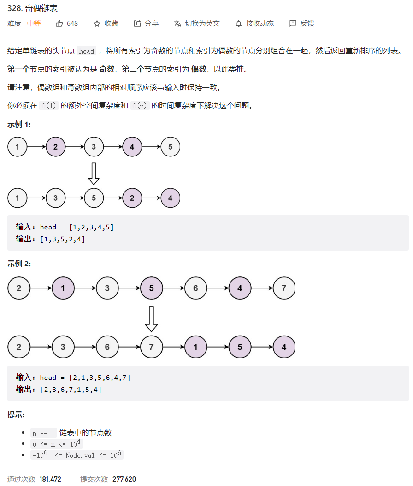



## 题目描述

> 🔥 [328. 奇偶链表](https://leetcode.cn/problems/odd-even-linked-list/)



## 思路分析

> 解题思路：
>
> 1. 创建两个链表，分别用于存储奇数节点和偶数节点，即 `oddHead` 和 `evenHead`。
> 2. 遍历原链表，根据节点的奇偶编号将节点连接到相应的链表上。
> 3. 最后，将 `oddHead` 的尾节点与 `evenHead` 的头节点相连接，并返回 `oddHead` 的头节点作为结果。

## 参考代码

```go
func oddEvenList(head *ListNode) *ListNode {
	if head == nil || head.Next == nil {
		return head
	}
	oddHead, evenHead := &ListNode{}, &ListNode{}
	odd, even := oddHead, evenHead
	isOdd := true
	cur := head
	for cur != nil {
		if isOdd {
			odd.Next = cur
			odd = odd.Next
		} else {
			even.Next = cur
			even = even.Next
		}
		isOdd = !isOdd
		cur = cur.Next
	}
	odd.Next = evenHead.Next
	even.Next = nil
	return oddHead.Next
}
```

<a class="button show-hidden">🍏 点击查看 Java 题解</a>

```java
write your code here
```

## 相似题目

| 题目                                                         | 难度   | 题解 |
| ------------------------------------------------------------ | ------ | ---- |
| [分隔链表](https://leetcode.cn/problems/split-linked-list-in-parts/) | Medium |      |
