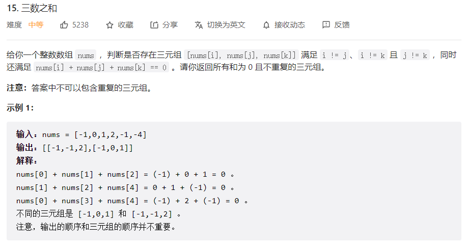
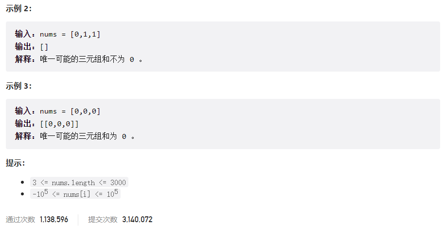



## 题目描述

> 🔥 [15. 三数之和](https://leetcode.cn/problems/3sum/)





## 思路分析

> 排序+双指针

## 参考代码

```go
func threeSum(nums []int) [][]int {
	res := make([][]int, 0)
	if len(nums) <= 2 {
		return res
	}
	sort.Ints(nums)
	for i := 0; i < len(nums)-2; i++ {
		if i > 0 && nums[i] == nums[i-1] {
			continue
		}
		target := -nums[i]
		left, right := i+1, len(nums)-1
		for left < right {
			twoSum := nums[left] + nums[right]
			if twoSum == target {
				res = append(res, []int{-target, nums[left], nums[right]})
				left++
				right--
				for left < right && nums[left] == nums[left-1] {
					left++
				}
				for left < right && nums[right] == nums[right+1] {
					right--
				}
			} else if twoSum > target {
				right--
			} else {
				left++
			}
		}
	}
	return res
}
```

<a class="button show-hidden">🍏 点击查看 Java 题解</a>

```java
class Solution {
    public List<List<Integer>> threeSum(int[] nums) {
        List<List<Integer>> res = new ArrayList<>();
        if (nums == null || nums.length <= 2) {
            return res;
        }
        Arrays.sort(nums);
        int n = nums.length;
        for (int i = 0; i < n - 2; i++) {
            if (i > 0 && nums[i] == nums[i - 1]) {
                continue;
            }
            int target = -nums[i];
            int left = i + 1, right = n - 1;
            while (left < right) {
                int sum = nums[left] + nums[right];
                if (sum == target) {
                    res.add(new ArrayList<>(Arrays.asList(-target, nums[left], nums[right])));
                    left++;
                    right--;
                    while (left < right && nums[left] == nums[left - 1]) {
                        left++;
                    }
                    while (left < right && nums[right] == nums[right + 1]) {
                        right--;
                    }
                } else if (sum > target) {
                    right--;
                } else {
                    left++;
                }
            }
        }
        return res;
    }
}
```

## 相似题目

| 题目                                                         | 难度   | 题解 |
| ------------------------------------------------------------ | ------ | ---- |
| [两数之和](https://leetcode.cn/problems/two-sum/)            | Easy   |      |
| [最接近的三数之和](https://leetcode.cn/problems/3sum-closest/) | Medium |      |
| [四数之和](https://leetcode.cn/problems/4sum/)               | Medium |      |
| [较小的三数之和](https://leetcode.cn/problems/3sum-smaller/) | Medium |      |
