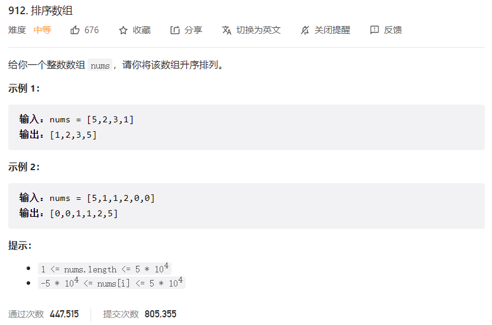



## 题目描述

> 🔥 [912. 排序数组](https://leetcode.cn/problems/sort-an-array/)



## 思路分析

> 1. 归并排序
>2. 快速排序
> 3. 堆排序

## 参考代码

### 归并排序

```java
class Solution {
    public int[] sortArray(int[] nums) {
        if (nums == null || nums.length <= 1) {
            return nums;
        }
        mergeSort(nums, 0, nums.length - 1);
        return nums;
    }

    public void mergeSort(int[] nums, int left, int right) {
        if (left >= right) {
            return;
        }
        int mid = left + (right - left) / 2;
        mergeSort(nums, left, mid);
        mergeSort(nums, mid + 1, right);
        merge(nums, left, mid, right);
    }

    public void merge(int[] nums, int left, int mid, int right) {
        int[] res = new int[right - left + 1];
        int p = 0, p1 = left, p2 = mid + 1;
        while (p1 <= mid && p2 <= right) {
            if (nums[p1] < nums[p2]) {
                res[p] = nums[p1];
                p1++;
            } else {
                res[p] = nums[p2];
                p2++;
            }
            p++;
        }
        while (p1 <= mid) {
            res[p] = nums[p1];
            p1++;
            p++;
        }
        while (p2 <= right) {
            res[p] = nums[p2];
            p2++;
            p++;
        }
        System.arraycopy(res, 0, nums, left, res.length);
    }
}
```

```go
func sortArray(nums []int) []int {
	return mergeSort(nums)
}

func mergeSort(nums []int) []int {
	if len(nums) <= 1 {
		return nums
	}
	mid := len(nums) / 2
	left := mergeSort(nums[:mid])
	right := mergeSort(nums[mid:])
	return merge(left, right)
}

func merge(nums1 []int, nums2 []int) []int {
	var res []int
	p1, p2 := 0, 0
	for p1 < len(nums1) && p2 < len(nums2) {
		if nums1[p1] < nums2[p2] {
			res = append(res, nums1[p1])
			p1++
		} else {
			res = append(res, nums2[p2])
			p2++
		}
	}
	res = append(res, nums1[p1:]...)
	res = append(res, nums2[p2:]...)
	return res
}
```

```go
func sortArray(nums []int) []int {
	if len(nums) <= 1 {
		return nums
	}
	mergeSort(nums, 0, len(nums)-1)
	return nums
}

func mergeSort(nums []int, left, right int) {
	if left >= right {
		return
	}
	mid := left + (right-left)/2
	mergeSort(nums, left, mid)
	mergeSort(nums, mid+1, right)
	merge(nums, left, mid, right)
}

func merge(nums []int, left, mid, right int) {
	var res []int
	p1, p2 := left, mid+1
	for p1 <= mid && p2 <= right {
		if nums[p1] < nums[p2] {
			res = append(res, nums[p1])
			p1++
		} else {
			res = append(res, nums[p2])
			p2++
		}
	}
	for p1 <= mid {
		res = append(res, nums[p1])
		p1++
	}
	for p2 <= right {
		res = append(res, nums[p2])
		p2++
	}
	for i := 0; i < len(res); i++ {
		nums[left+i] = res[i]
	}
}
```

### 快速排序

```java
class Solution {
    public int[] sortArray(int[] nums) {
        if (nums == null || nums.length < 2) {
            return nums;
        }
        quickSort(nums, 0, nums.length - 1);
        return nums;
    }

    // 快速排序
    private void quickSort(int[] nums, int left, int right) {
        if (left >= right) return;
        int index = (int) (Math.random() * (right - left + 1)) + left;
        swap(nums, index, left);
        int i = left, j = right; // 左右指针
        int point = nums[left]; // 第一个元素作为基准点
        // i == j 的时候退出循环, 此时这个位置存放基准点
        while (i < j) {
            while (i < j && nums[j] > point) j--;
            if (i < j) nums[i++] = nums[j];
            while (i < j && nums[i] < point) i++;
            if (i < j) nums[j--] = nums[i];
        }
        nums[i] = point; // 或者 nums[j] = point, 此时 i == j, 基准点存放的位置
        quickSort(nums, left, i - 1); // 递归左半部分
        quickSort(nums, i + 1, right); // 递归右半部分
    }

    private void swap(int[] nums, int i, int j) {
        int temp = nums[i];
        nums[i] = nums[j];
        nums[j] = temp;
    }
}
```

```go
func sortArray(nums []int) []int {
	if len(nums) <= 1 {
		return nums
	}
	quickSort(nums, 0, len(nums)-1)
	return nums
}

func quickSort(nums []int, left int, right int) {
	if left >= right {
		return
	}
	i, j := left, right
	point := nums[i]
	for i < j {
		for i < j && nums[j] > point {
			j--
		}
		if i < j {
			nums[i] = nums[j]
			i++
		}
		for i < j && nums[i] < point {
			i++
		}
		if i < j {
			nums[j] = nums[i]
			j--
		}
	}
	nums[i] = point
	quickSort(nums, left, i-1)
	quickSort(nums, i+1, right)
}
```

```go
func sortArray(nums []int) []int {
	if len(nums) <= 1 {
		return nums
	}

	var res []int
	point := nums[0]
	var left, right []int

	for _, num := range nums[1:] {
		if num > point {
			right = append(right, num)
		} else {
			left = append(left, num)
		}
	}

	sortedLeft := sortArray(left)
	sortedRight := sortArray(right)

	res = append(res, sortedLeft...)
	res = append(res, point)
	res = append(res, sortedRight...)
	return res
}
```

```go
func sortArray(nums []int) []int {
	if len(nums) <= 1 {
		return nums
	}
	rand.Seed(time.Now().Unix())
	quickSort(nums, 0, len(nums)-1)
	return nums
}

func quickSort(nums []int, left, right int) {
	if left >= right {
		return
	}
	pointIndex := rand.Intn(right-left+1) + left
	nums[left], nums[pointIndex] = nums[pointIndex], nums[left]
	point := nums[left]
	i, j := left, right
	for i < j {
		for i < j && nums[j] >= point {
			j--
		}
		if i < j {
			nums[i] = nums[j]
			i++
		}
		for i < j && nums[i] <= point {
			i++
		}
		if i < j {
			nums[j] = nums[i]
			j--
		}
	}
	nums[i] = point
	quickSort(nums, left, i-1)
	quickSort(nums, i+1, right)
}
```

### 堆排序

```java
class Solution {
    public int[] sortArray(int[] nums) {
        if (nums == null || nums.length < 2) {
            return nums;
        }
        heapSort(nums);
        return nums;
    }

    // 堆排序
    private void heapSort(int[] nums) {
        if (nums == null || nums.length < 2) {
            return;
        }
        for (int i = nums.length / 2 - 1; i >= 0; i--) {
            shiftHeap(nums, i, nums.length);
        }
        for (int j = nums.length - 1; j > 0; j--) {
            swap(nums, 0, j);
            shiftHeap(nums, 0, j);
        }
    }

    // 调整一个数组为大顶推(升序)
    private void shiftHeap(int[] nums, int k, int len) {
        while (2 * k + 1 < len) {
            int j = 2 * k + 1;
            if (j + 1 < len && nums[j + 1] > nums[j]) j++;
            if (nums[k] >= nums[j]) break;
            swap(nums, k, j);
            k = j;
        }
    }

    private void swap(int[] nums, int i, int j) {
        int temp = nums[i];
        nums[i] = nums[j];
        nums[j] = temp;
    }
}
```

```go
write your code here
```
