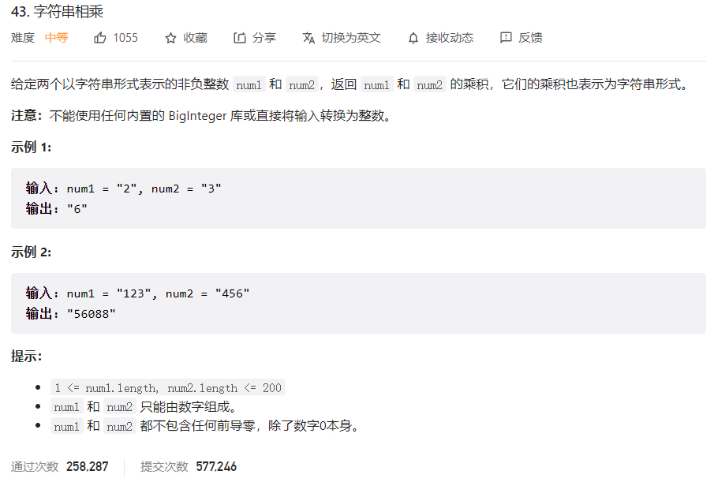
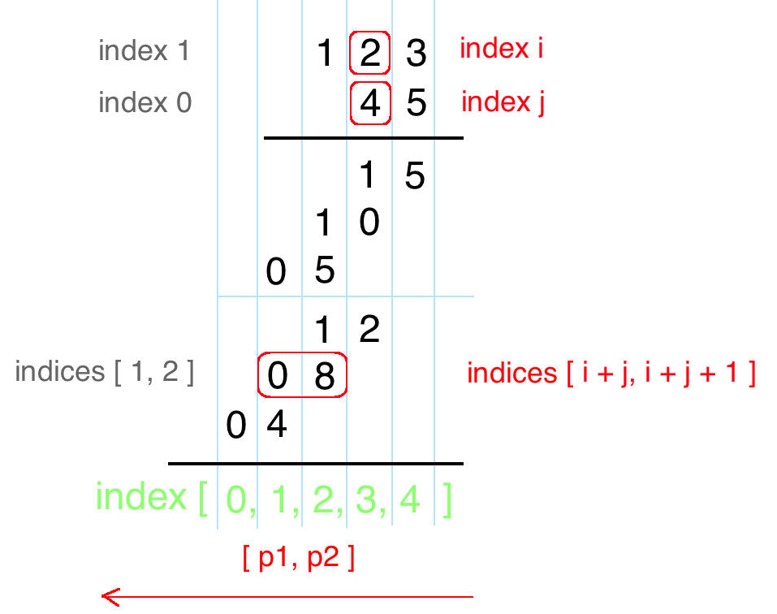
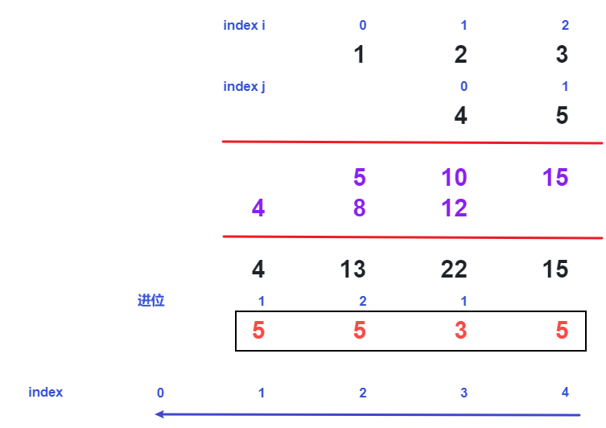



## 题目描述

> 🔥 [43. 字符串相乘](https://leetcode.cn/problems/multiply-strings/)



## 思路分析

> 竖式乘法





## 参考代码

```go
func multiply(num1 string, num2 string) string {
	if num1 == "0" || num2 == "0" {
		return "0"
	}
	m, n := len(num1), len(num2)
	res := make([]int, m+n)
	for i := m - 1; i >= 0; i-- {
		for j := n - 1; j >= 0; j-- {
			mul := int(num1[i]-'0') * int(num2[j]-'0')
			sum := mul + res[i+j+1]
			res[i+j+1] = sum % 10
			res[i+j] += sum / 10
		}
	}
	var sb strings.Builder
	for _, digit := range res {
		sb.WriteString(fmt.Sprintf("%d", digit))
	}
	return strings.TrimLeft(sb.String(), "0")
}
```

<a class="button show-hidden">🍏 点击查看 Java 题解(一)</a>

```java
write your code here
```

<a class="button show-hidden">🍏 点击查看 Java 题解(二)</a>

```java
write your code here
```

## 相似题目

| 题目                                                         | 难度   | 题解 |
| ------------------------------------------------------------ | ------ | ---- |
| [两数相加](https://leetcode.cn/problems/add-two-numbers/) | Medium |      |
| [加一](https://leetcode.cn/problems/plus-one/) | Easy |      |
| [二进制求和](https://leetcode.cn/problems/add-binary/) | Easy |      |
| [字符串相加](https://leetcode.cn/problems/add-strings/) | Easy |      |
