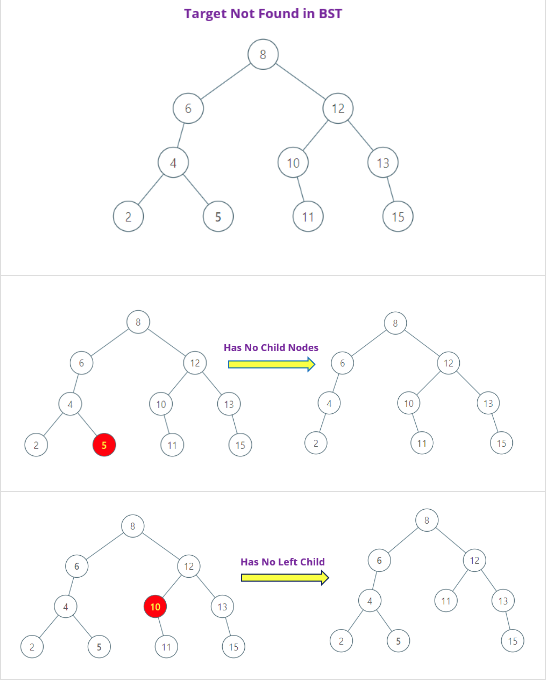
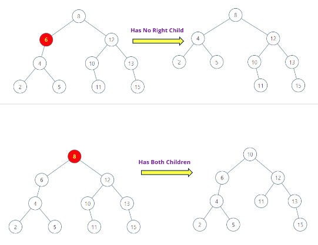



## 题目描述

> 🔥 [450. 删除二叉搜索树中的节点](https://leetcode.cn/problems/delete-node-in-a-bst/)

## 思路分析

> 1. 如果目标节点大于当前节点值，则去右子树中删除；
>
> 2. 如果目标节点小于当前节点值，则去左子树中删除；
>
> 3. 如果目标节点就是当前节点，分为以下三种情况：
>
>     a. 其无左子：其右子顶替其位置，删除了该节点；
>
>     b. 其无右子：其左子顶替其位置，删除了该节点；
>
>     c. 其左右子节点都有：其左子树转移到其右子树最左节点的左子树上，然后右子树顶替其位置，由此删除了该节点。





## 参考代码

```go
write your code here
```

<a class="button show-hidden">🍏 点击查看 Java 题解</a>

```java
write your code here
```

## 相似题目

| 题目                                                         | 难度   | 题解 |
| ------------------------------------------------------------ | ------ | ---- |
| [拆分二叉搜索树](https://leetcode.cn/problems/split-bst/) | Medium |      |
