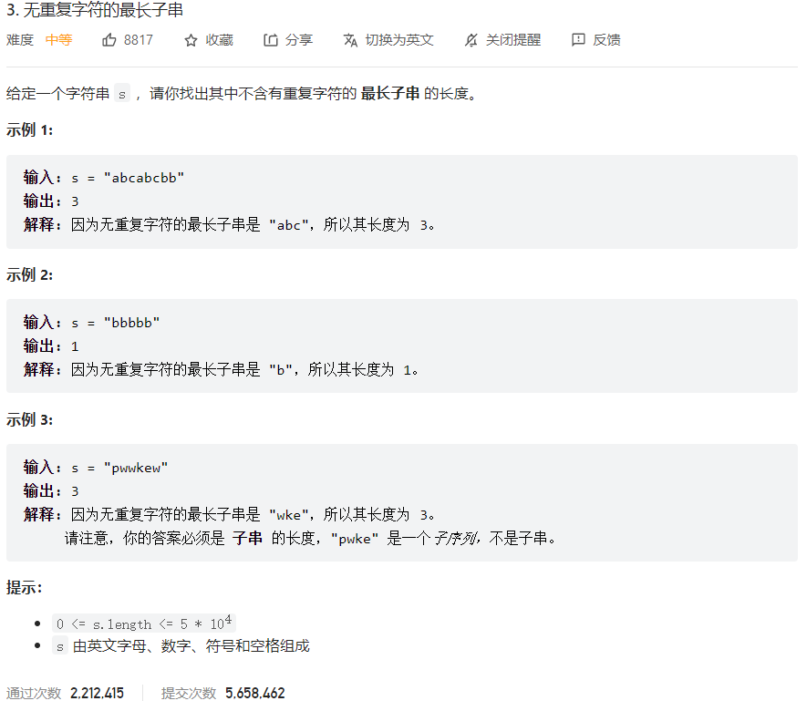



## 题目描述

> 🔥 [3. 无重复字符的最长子串](https://leetcode.cn/problems/longest-substring-without-repeating-characters/)



## 思路分析

> 滑动窗口

## 参考代码

> 特例：`i = max(i, hashtable.get(c) + 1)`
>
> 输入: "abba"
>
> 输出: 2
>
> 解释: 因为无重复字符的最长子串是 "ab / ba"，所以其长度为 2。

```go
func lengthOfLongestSubstring(s string) int {
	hashmap := make(map[byte]int)
	res := 0
	left, right := 0, 0
	for right < len(s) {
		c := s[right]
		if index, ok := hashmap[c]; ok {
			left = max(left, index+1)
		}
		res = max(res, right-left+1)
		hashmap[c] = right
		right++
	}
	return res
}

func max(a, b int) int {
	if a > b {
		return a
	}
	return b
}
```

```go
func lengthOfLongestSubstring(s string) int {
	left, right, n := 0, 0, len(s)
	visited := make(map[byte]bool)
	res := 0
	for right < n {
		c := s[right]
		for visited[c] {
			delete(visited, s[left])
			left++
		}
		visited[c] = true
		right++
		if right-left > res {
			res = right - left
		}
	}
	return res
}
```

<a class="button show-hidden">🍏 点击查看 Java 题解</a>

```java
class Solution {
    public int lengthOfLongestSubstring(String s) {
        Map<Character, Integer> map = new HashMap<>();
        int i = 0;
        int res = 0;
        for (int j = 0; j < s.length(); j++) {
            char c = s.charAt(j);
            if (map.containsKey(c)) {
                i = Math.max(i, map.get(c) + 1);
            }
            res = Math.max(res, j - i + 1);
            map.put(c, j);
        }
        return res;
    }
}
```

## 相似题目

| 题目                                                         | 难度   | 题解 |
| ------------------------------------------------------------ | ------ | ---- |
| [至多包含两个不同字符的最长子串](https://leetcode.cn/problems/longest-substring-with-at-most-two-distinct-characters/) | Medium |      |
| [至多包含 K 个不同字符的最长子串](https://leetcode.cn/problems/longest-substring-with-at-most-k-distinct-characters/) | Medium |      |
| [K 个不同整数的子数组](https://leetcode.cn/problems/subarrays-with-k-different-integers/) | Hard |      |
