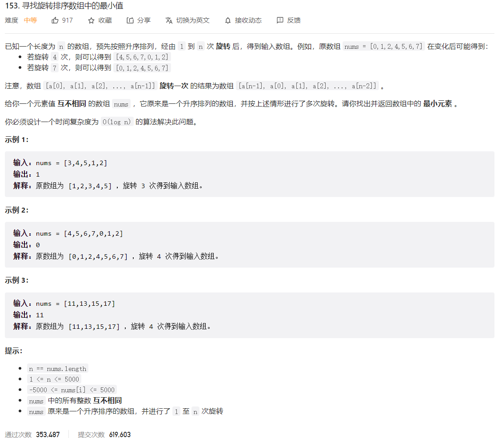



## 题目描述

> 🔥 [153. 寻找旋转排序数组中的最小值](https://leetcode.cn/problems/find-minimum-in-rotated-sorted-array/)



## 思路分析

> 二分查找

## 参考代码

```go
func findMin(nums []int) int {
	left, right := 0, len(nums)-1
	for left < right {
		mid := left + (right-left)/2
		// 当中间元素大于右侧元素时，说明最小值在右半部分
		if nums[mid] > nums[right] {
			left = mid + 1
		} else if nums[mid] < nums[right] {
			// 当中间元素小于右侧元素时，说明最小值在左半部分或就是中间元素
			right = mid
		} else {
			// 当中间元素等于右侧元素时，无法确定最小值的位置，缩小搜索范围
			right--
		}
	}
	return nums[left]
}
```

<a class="button show-hidden">🍏 点击查看 Java 题解</a>

```java
write your code here
```

## 相似题目

| 题目                                                         | 难度   | 题解 |
| ------------------------------------------------------------ | ------ | ---- |
| [搜索旋转排序数组](https://leetcode.cn/problems/search-in-rotated-sorted-array/) | Medium |      |
| [寻找旋转排序数组中的最小值 II](https://leetcode.cn/problems/find-minimum-in-rotated-sorted-array-ii/) | Hard |      |
