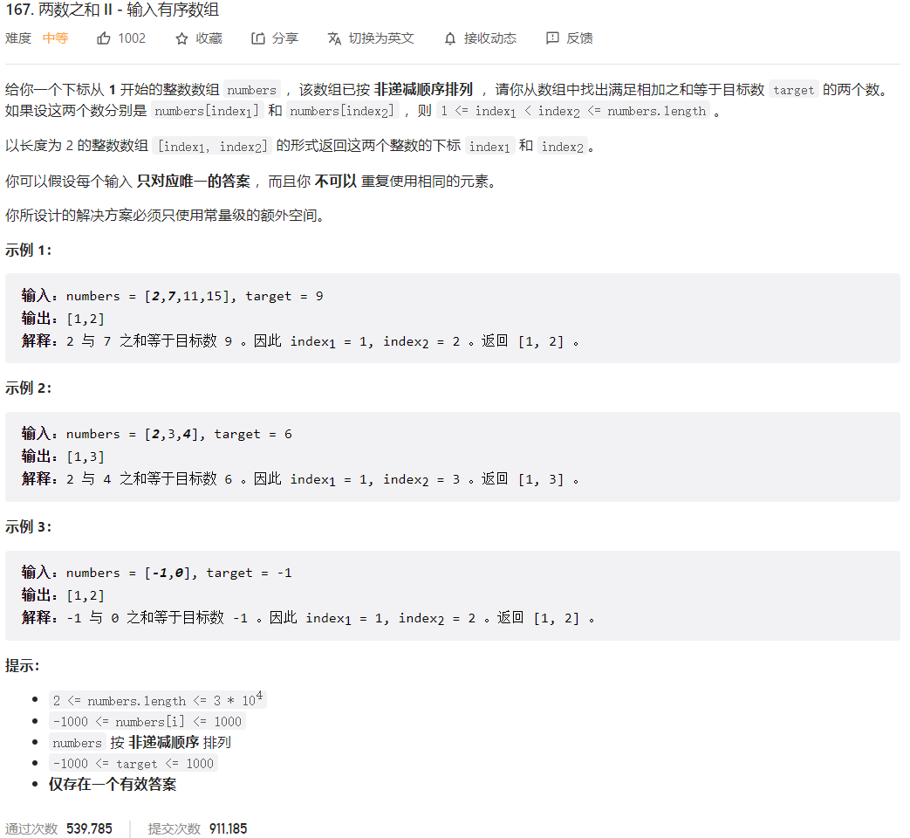



## 题目描述

> 🔥 [167. 两数之和 II - 输入有序数组](https://leetcode.cn/problems/two-sum-ii-input-array-is-sorted/)



## 思路分析

> 双指针

## 参考代码

```go
func twoSum(numbers []int, target int) []int {
	left, right := 0, len(numbers)-1
	for left < right {
		cur := numbers[left] + numbers[right]
		if cur > target {
			right--
		} else if cur < target {
			left++
		} else {
			return []int{left + 1, right + 1}
		}
	}
	return nil
}
```

<a class="button show-hidden">🍏 点击查看 Java 题解</a>

```java
write your code here
```

## 相似题目

| 题目                                                         | 难度   | 题解 |
| ------------------------------------------------------------ | ------ | ---- |
| [两数之和](https://leetcode.cn/problems/two-sum/) | Easy |      |
| [两数之和 IV - 输入二叉搜索树](https://leetcode.cn/problems/two-sum-iv-input-is-a-bst/) | Easy |      |
| [小于 K 的两数之和](https://leetcode.cn/problems/two-sum-less-than-k/) | Easy |      |
