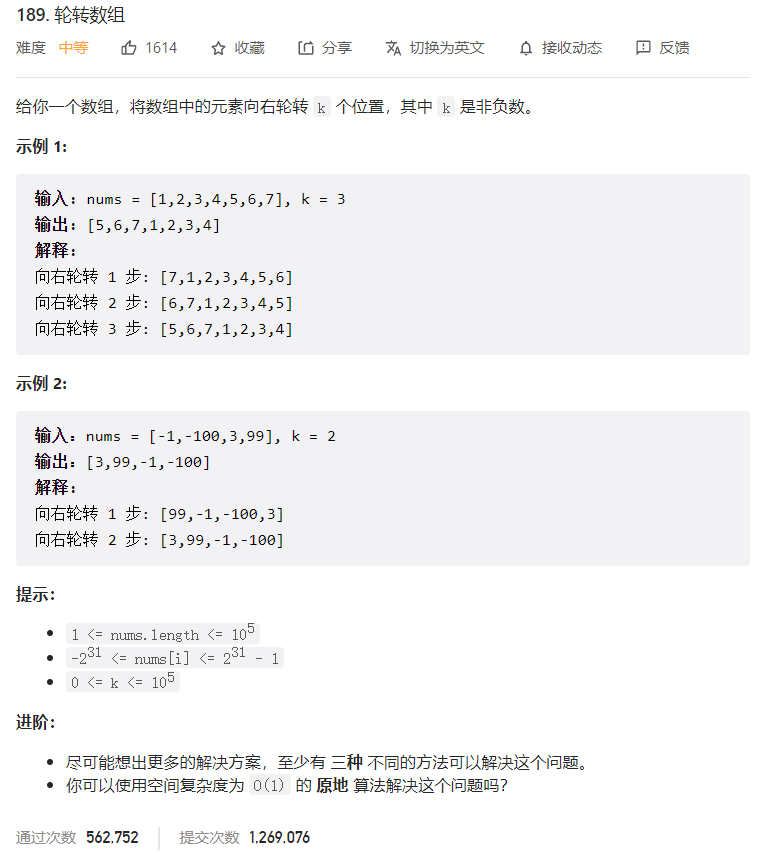



## 题目描述

> 🔥 [189. 轮转数组](https://leetcode.cn/problems/rotate-array/)



## 思路分析

> 三次翻转：先翻转集合的左右两部分，然后翻转整个集合。

## 参考代码

```go
write your code here
```

<a class="button show-hidden">🍏 点击查看 Java 题解</a>

```java
write your code here
```

## 相似题目

| 题目                                                         | 难度   | 题解 |
| ------------------------------------------------------------ | ------ | ---- |
| [旋转链表](https://leetcode.cn/problems/rotate-list/) | Medium |      |
| [反转字符串中的单词 II](https://leetcode.cn/problems/reverse-words-in-a-string-ii/) | Medium |      |
