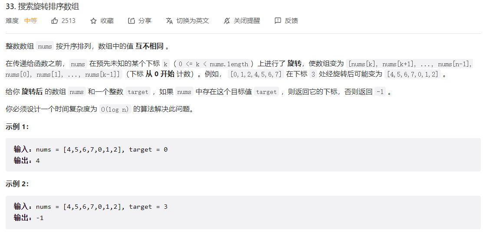
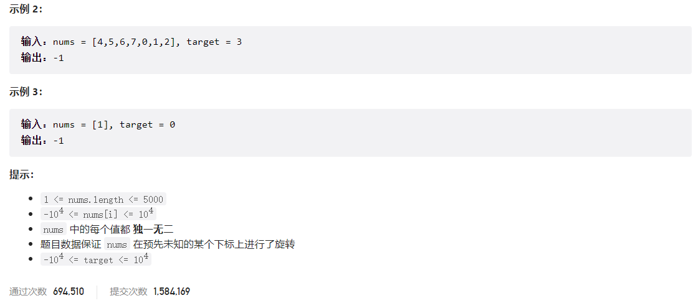
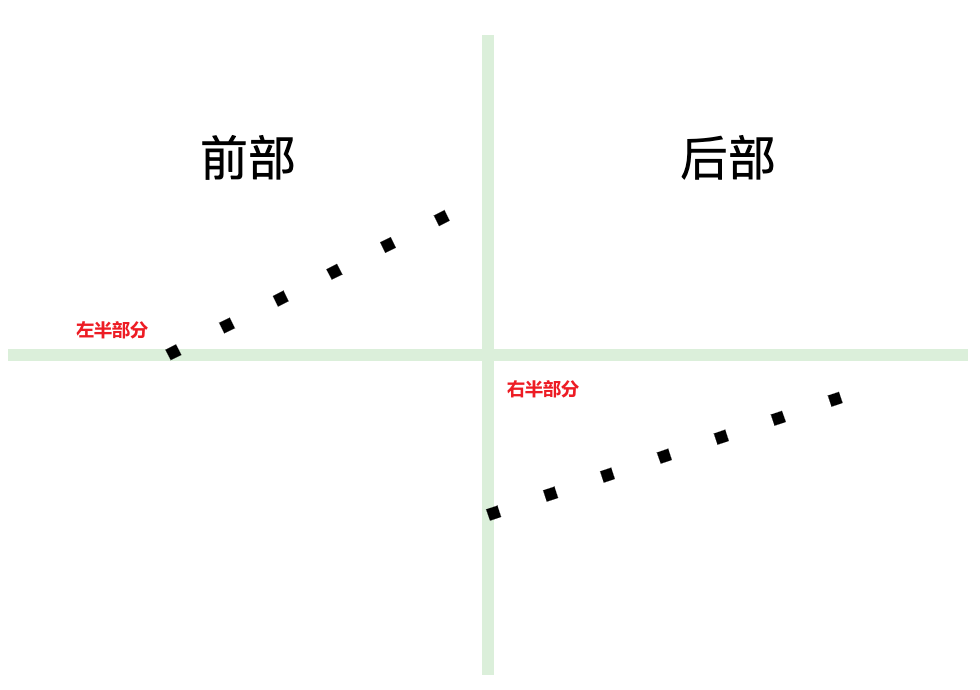



## 题目描述

> 🔥 [33. 搜索旋转排序数组](https://leetcode.cn/problems/search-in-rotated-sorted-array/)





## 思路分析

> 二分查找
>
> 如果中间的数**小于**最右边的数，则右半部分是有序的。
>
> 如果中间的数**大于**最右边的数，则左半部分是有序的。
>



## 参考代码

```go
func search(nums []int, target int) int {
	left, right := 0, len(nums)-1
	for left <= right {
		mid := left + (right-left)/2
		if nums[mid] == target {
			return mid
		}
		if nums[mid] > nums[right] {
			// 左半部分有序
			if target >= nums[left] && target < nums[mid] {
				right = mid - 1
			} else {
				left = mid + 1
			}
		} else if nums[mid] < nums[right] {
			// 右半部分有序
			if target > nums[mid] && target <= nums[right] {
				left = mid + 1
			} else {
				right = mid - 1
			}
		} else {
			right--
		}
	}
	return -1
}
```

<a class="button show-hidden">🍏 点击查看 Java 题解</a>

```java
class Solution {
    public int search(int[] nums, int target) {
        int left = 0, right = nums.length - 1;
        while (left <= right) {
            int mid = left + (right - left) / 2;
            if (nums[mid] == target) {
                return mid;
            }
            if (nums[mid] > nums[right]) {
                if (target >= nums[left] && target < nums[mid]) {
                    right = mid - 1;
                } else {
                    left = mid + 1;
                }
            } else if ((nums[mid] < nums[right])) {
                if (target > nums[mid] && target <= nums[right]) {
                    left = mid + 1;
                } else {
                    right = mid - 1;
                }
            } else {
                right--;
            }
        }
        return -1;
    }
}
```

## 相似题目

| 题目                                                         | 难度   | 题解 |
| ------------------------------------------------------------ | ------ | ---- |
| [搜索旋转排序数组 II](https://leetcode.cn/problems/search-in-rotated-sorted-array-ii/) | Medium |      |
| [寻找旋转排序数组中的最小值](https://leetcode.cn/problems/find-minimum-in-rotated-sorted-array/) | Medium |      |
