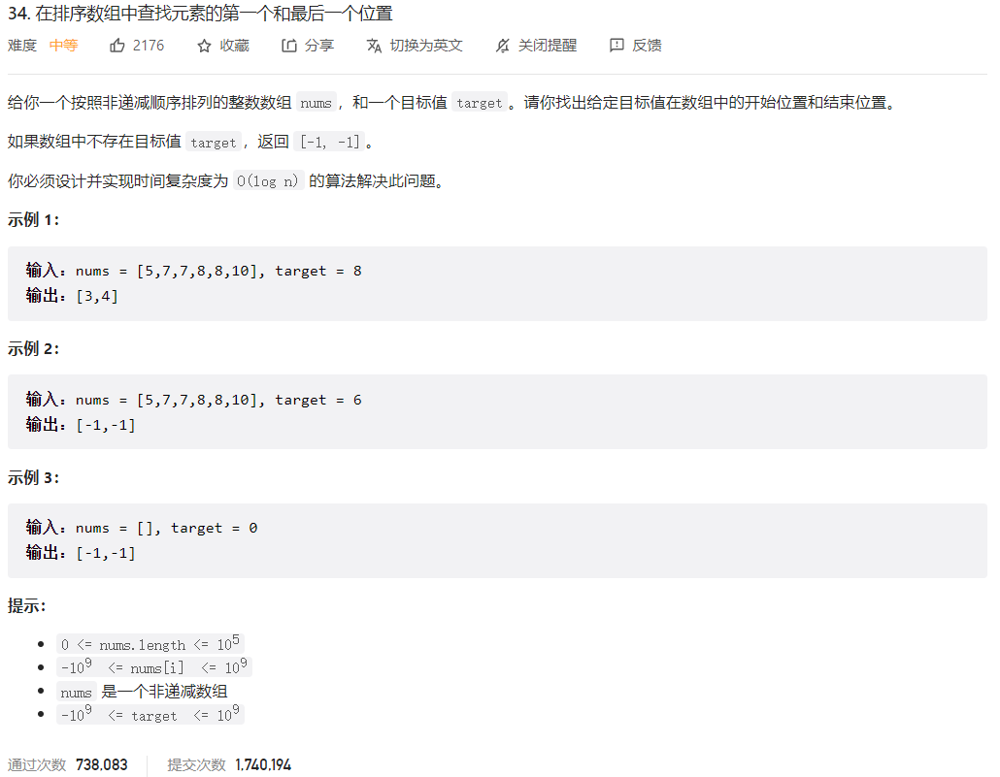



## 题目描述

> 🔥 [34. 在排序数组中查找元素的第一个和最后一个位置](https://leetcode.cn/problems/find-first-and-last-position-of-element-in-sorted-array/)



## 思路分析

> 等于给定值的第一个元素和最后一个元素

## 参考代码

```go
func searchRange(nums []int, target int) []int {
	left, right := searchLeft(nums, target), searchRight(nums, target)
	return []int{left, right}
}

func searchLeft(nums []int, target int) int {
	left, right := 0, len(nums)-1
	first := -1
	for left <= right {
		mid := left + (right-left)/2
		if nums[mid] > target {
			right = mid - 1
		} else if nums[mid] < target {
			left = mid + 1
		} else {
			first = mid
			right = mid - 1
		}
	}
	return first
}

func searchRight(nums []int, target int) int {
	left, right := 0, len(nums)-1
	last := -1
	for left <= right {
		mid := left + (right-left)/2
		if nums[mid] > target {
			right = mid - 1
		} else if nums[mid] < target {
			left = mid + 1
		} else {
			last = mid
			left = mid + 1
		}
	}
	return last
}
```

<a class="button show-hidden">🍏 点击查看 Java 题解</a>

```java
class Solution {
    public int[] searchRange(int[] nums, int target) {
        int left = searchLeft(nums, target);
        int right = searchRight(nums, target);
        return new int[]{left, right};
    }

    public int searchLeft(int[] nums, int target) {
        int left = 0, right = nums.length - 1;
        int first = -1;
        while (left <= right) {
            int mid = left + (right - left) / 2;
            if (nums[mid] > target) {
                right = mid - 1;
            } else if (nums[mid] < target) {
                left = mid + 1;
            } else {
                first = mid;
                right = mid - 1;
            }
        }
        return first;
    }

    public int searchRight(int[] nums, int target) {
        int left = 0, right = nums.length - 1;
        int last = -1;
        while (left <= right) {
            int mid = left + (right - left) / 2;
            if (nums[mid] > target) {
                right = mid - 1;
            } else if (nums[mid] < target) {
                left = mid + 1;
            } else {
                last = mid;
                left = mid + 1;
            }
        }
        return last;
    }
}
```

## 相似题目

| 题目                                                         | 难度   | 题解 |
| ------------------------------------------------------------ | ------ | ---- |
| [第一个错误的版本](https://leetcode.cn/problems/first-bad-version/) | Easy |      |
