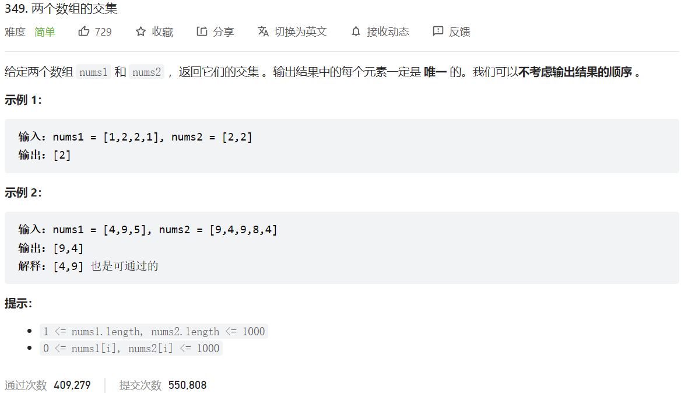



## 题目描述

> 🔥 [349. 两个数组的交集](https://leetcode.cn/problems/intersection-of-two-arrays/)



## 思路分析

> 排序+双指针

## 参考代码

```go
func intersection(nums1 []int, nums2 []int) []int {
	numSet := make(map[int]bool)
	res := make([]int, 0)
	for _, num := range nums1 {
		numSet[num] = true
	}
	for _, num := range nums2 {
		if value := numSet[num]; value {
			res = append(res, num)
			numSet[num] = false
		}
	}
	return res
}
```

<a class="button show-hidden">🍏 点击查看 Java 题解</a>

```java
write your code here
```

## 相似题目

| 题目                                                         | 难度   | 题解 |
| ------------------------------------------------------------ | ------ | ---- |
| [两个数组的交集 II](https://leetcode.cn/problems/intersection-of-two-arrays-ii/) | Easy |      |
| [三个有序数组的交集](https://leetcode.cn/problems/intersection-of-three-sorted-arrays/) | Easy |      |
