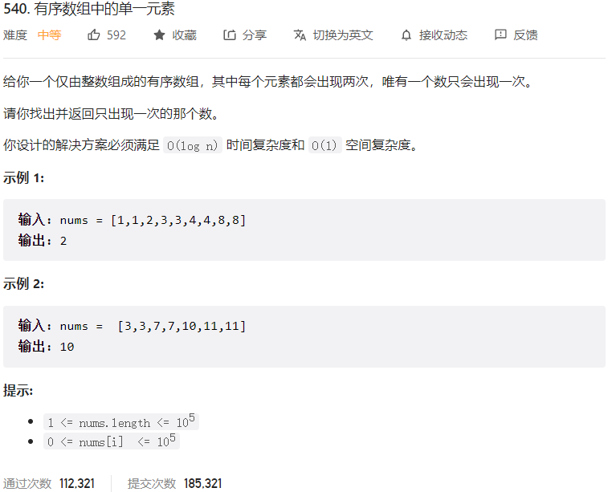



## 题目描述

> 🔥 [540. 有序数组中的单一元素](https://leetcode.cn/problems/single-element-in-a-sorted-array/)



## 思路分析

> **解法一：暴力枚举**
> **解法二：二分查找**
> 由于数组是有序的，可以使用二分查找的思想，每次找到中间的数，判断它是否为单一元素，如果不是，则判断它左右两边的元素个数是否为奇数，如果是，则单一元素在左边，否则在右边。
> **解法三：异或运算**

## 参考代码

```go
write your code here
```

<a class="button show-hidden">🍏 点击查看 Java 题解</a>

```java
class Solution {
    public int singleNonDuplicate(int[] nums) {
        int res = 0;
        for (int num : nums) {
            res ^= num;
        }
        return res;
    }
}
```

```java
class Solution {
    public int singleNonDuplicate(int[] nums) {
        int left = 0;
        int right = nums.length - 1;
        while (left < right) {
            int mid = left + (right - left) / 2;
            // 确保mid在偶数位置，使得判断条件一直在偶数位置和奇数位置进行比较
            if (mid % 2 == 1) {
                mid--;
            }
            // 如果mid与下一个元素不相等，说明单一元素在mid的左侧
            if (nums[mid] != nums[mid + 1]) {
                right = mid;
            } else {
                // 否则，单一元素在mid的右侧
                left = mid + 2;
            }
        }
        return nums[left];
    }
}
```
