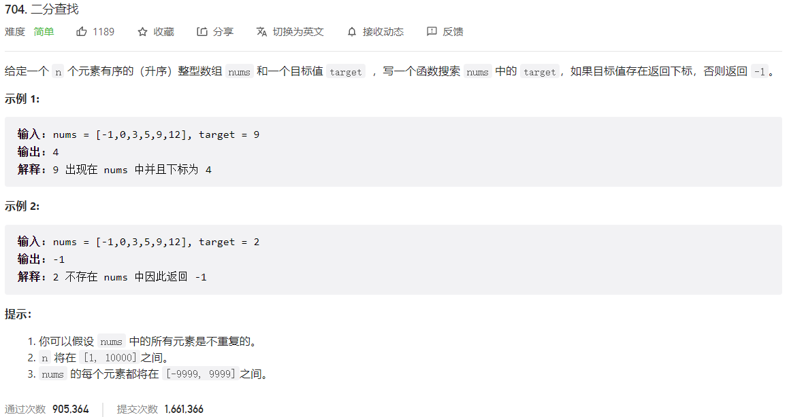



## 题目描述

> 🔥 [704. 二分查找](https://leetcode.cn/problems/binary-search/)



## 思路分析

> 二分查找

## 参考代码

```go
func search(nums []int, target int) int {
	left, right := 0, len(nums)-1
	for left <= right {
		mid := left + (right-left)/2
		if nums[mid] > target {
			right = mid - 1
		} else if nums[mid] < target {
			left = mid + 1
		} else {
			return mid
		}
	}
	return -1
}
```

<a class="button show-hidden">🍏 点击查看 Java 题解</a>

```java
class Solution {
    public int search(int[] nums, int target) {
        int left = 0, right = nums.length - 1;
        while (left <= right) {
            int mid = left + (right - left) / 2;
            if (nums[mid] == target) {
                return mid;
            } else if (nums[mid] > target) {
                right = mid - 1;
            } else {
                left = mid + 1;
            }
        }
        return -1;
    }
}
```

## 相似题目

| 题目                                                         | 难度   | 题解 |
| ------------------------------------------------------------ | ------ | ---- |
| [搜索长度未知的有序数组](https://leetcode.cn/problems/search-in-a-sorted-array-of-unknown-size/) | Medium |      |
