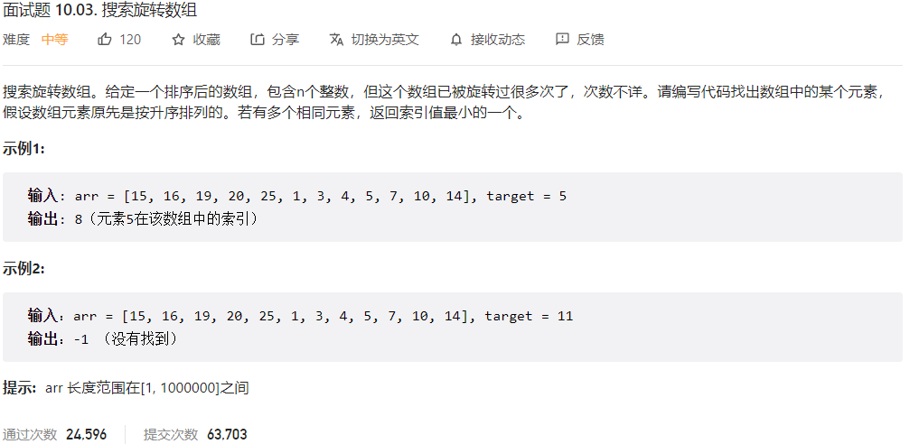



## 题目描述

> 🔥 [面试题 10.03. 搜索旋转数组](https://leetcode.cn/problems/search-rotate-array-lcci/)



## 思路分析

> 思路描述

## 参考代码

```go
func search(nums []int, target int) int {
	left, right := 0, len(nums)-1
	res := -1
	for left <= right {
		if nums[left] == target {
			return left
		}
		mid := left + (right-left)/2
		if nums[mid] == target {
			res = mid
			right = mid - 1
		} else if nums[mid] > nums[right] {
			if nums[left] <= target && target < nums[mid] {
				right = mid - 1
			} else {
				left = mid + 1
			}
		} else if nums[mid] < nums[right] {
			if nums[mid] < target && target <= nums[right] {
				left = mid + 1
			} else {
				right = mid - 1
			}
		} else {
			right--
		}
	}
	return res
}
```

<a class="button show-hidden">🍏 点击查看 Java 题解</a>

```java
write your code here
```
