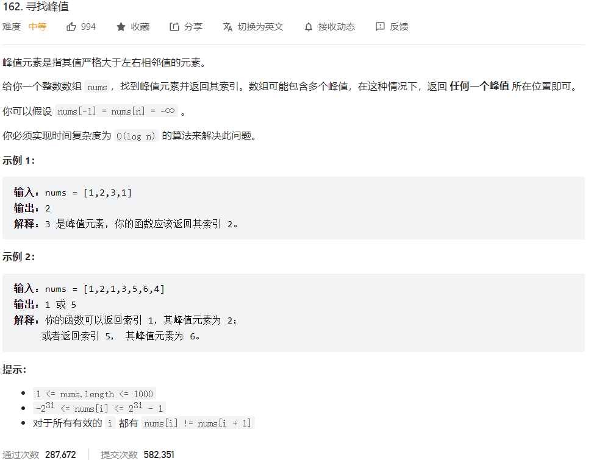



## 题目描述

> 🔥 [162. 寻找峰值](https://leetcode.cn/problems/find-peak-element/)



## 思路分析

> 二分查找
>
> 规律一：如果 nums[i] > nums[i+1]，则在 i 之前一定存在峰值元素
>
> 规律二：如果 nums[i] < nums[i+1]，则在 i+1 之后一定存在峰值元素

## 参考代码

```go
func findPeakElement(nums []int) int {
	left, right := 0, len(nums)-1

	for left < right {
		mid := left + (right-left)/2
		if nums[mid] > nums[mid+1] {
			right = mid
		} else {
			left = mid + 1
		}
	}

	return left
}
```

<a class="button show-hidden">🍏 点击查看 Java 题解</a>

```java
write your code here
```

## 相似题目

| 题目                                                         | 难度   | 题解 |
| ------------------------------------------------------------ | ------ | ---- |
| [山脉数组的峰顶索引](https://leetcode.cn/problems/peak-index-in-a-mountain-array/) | Medium |      |
