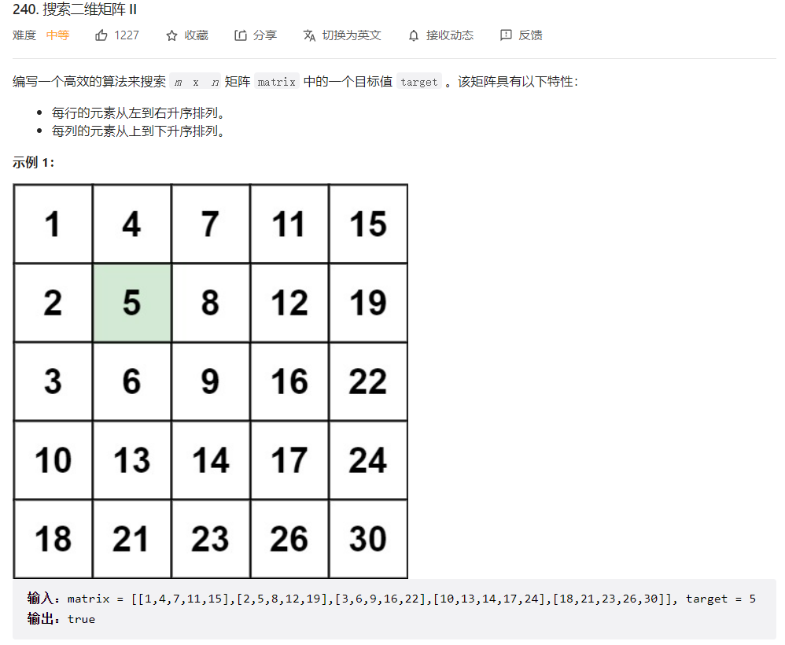
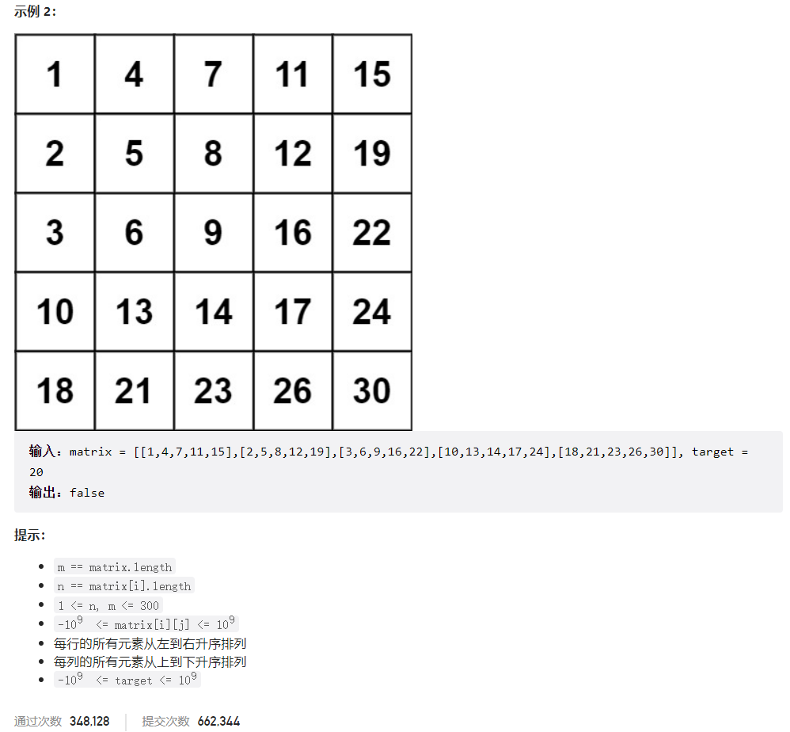



## 题目描述

> 🔥 [240. 搜索二维矩阵 II](https://leetcode.cn/problems/search-a-2d-matrix-ii/)





## 思路分析

> 分治法

## 参考代码

```go
func searchMatrix(matrix [][]int, target int) bool {
	if len(matrix) == 0 || len(matrix[0]) == 0 {
		return false
	}
	m, n := len(matrix)-1, len(matrix[0])-1
	i, j := 0, n
	for i <= m && j >= 0 {
		if matrix[i][j] > target {
			j--
		} else if matrix[i][j] < target {
			i++
		} else {
			return true
		}
	}
	return false
}
```

<a class="button show-hidden">🍏 点击查看 Java 题解</a>

```java
write your code here
```

## 相似题目

| 题目                                                         | 难度   | 题解 |
| ------------------------------------------------------------ | ------ | ---- |
| [搜索二维矩阵](https://leetcode.cn/problems/search-a-2d-matrix/) | Medium |      |
