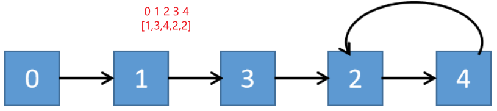



## 题目描述

> 🔥 [287. 寻找重复数](https://leetcode.cn/problems/find-the-duplicate-number/)

## 思路分析

> 快慢指针



## 参考代码

```go
write your code here
```

<a class="button show-hidden">🍏 点击查看 Java 题解</a>

```java
write your code here
```

## 相似题目

| 题目                                                         | 难度   | 题解 |
| ------------------------------------------------------------ | ------ | ---- |
| [缺失的第一个正数](https://leetcode.cn/problems/first-missing-positive/) | Hard |      |
| [只出现一次的数字](https://leetcode.cn/problems/single-number/) | Easy |      |
| [环形链表 II](https://leetcode.cn/problems/linked-list-cycle-ii/) | Medium |      |
| [丢失的数字](https://leetcode.cn/problems/missing-number/) | Easy |      |
| [错误的集合](https://leetcode.cn/problems/set-mismatch/) | Easy |      |
