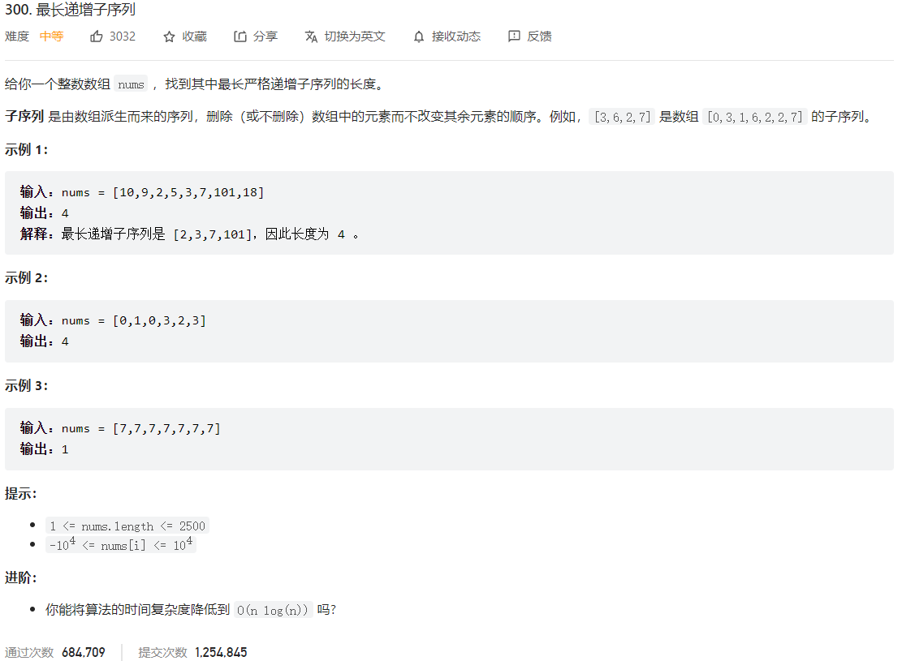



## 题目描述

> 🔥 [300. 最长递增子序列](https://leetcode.cn/problems/longest-increasing-subsequence/)



## 思路分析

> `dp[i]` 表示以 `nums[i]` 结尾的最长递增子序列的长度

## 参考代码

```go
func lengthOfLIS(nums []int) int {
	if len(nums) == 0 {
		return 0
	}
	// dp[i] 表示以 nums[i] 结尾的最长递增子序列的长度
	dp := make([]int, len(nums))
	dp[0] = 1
	res := 1
	for i := 1; i < len(nums); i++ {
		dp[i] = 1
		for j := 0; j < i; j++ {
			if nums[i] > nums[j] {
				dp[i] = max(dp[i], dp[j]+1)
			}
		}
		res = max(res, dp[i])
	}
	return res
}

func max(a, b int) int {
	if a > b {
		return a
	}
	return b
}
```

<a class="button show-hidden">🍏 点击查看 Java 题解</a>

```java
class Solution {
    public int lengthOfLIS(int[] nums) {
        int n = nums.length;
        int[] dp = new int[n];
        Arrays.fill(dp, 1);
        int res = 0;
        for (int i = 0; i < n; i++) {
            for (int j = 0; j < i; j++) {
                if (nums[j] < nums[i]) {
                    dp[i] = Math.max(dp[i], dp[j] + 1);
                }
            }
            res = Math.max(res, dp[i]);
        }
        return res;
    }
}
```

## 相似题目

| 题目                                                         | 难度   | 题解 |
| ------------------------------------------------------------ | ------ | ---- |
| [递增的三元子序列](https://leetcode.cn/problems/increasing-triplet-subsequence/) | Medium |      |
| [俄罗斯套娃信封问题](https://leetcode.cn/problems/russian-doll-envelopes/) | Hard |      |
| [最长数对链](https://leetcode.cn/problems/maximum-length-of-pair-chain/) | Medium |      |
| [最长递增子序列的个数](https://leetcode.cn/problems/number-of-longest-increasing-subsequence/) | Medium |      |
| [两个字符串的最小 ASCII 删除和](https://leetcode.cn/problems/minimum-ascii-delete-sum-for-two-strings/) | Medium |      |
