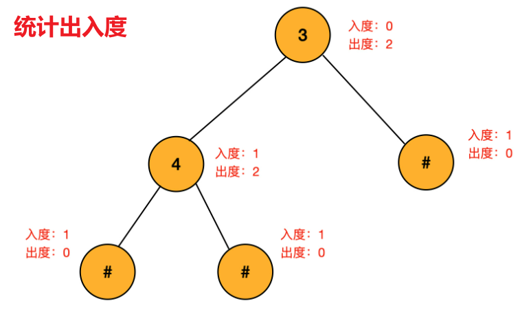



## 题目描述

> 🔥 [331. 验证二叉树的前序序列化](https://leetcode.cn/problems/verify-preorder-serialization-of-a-binary-tree/)

## 思路分析

> 统计出入度



## 参考代码

```go
write your code here
```

<a class="button show-hidden">🍏 点击查看 Java 题解</a>

```java
write your code here
```
