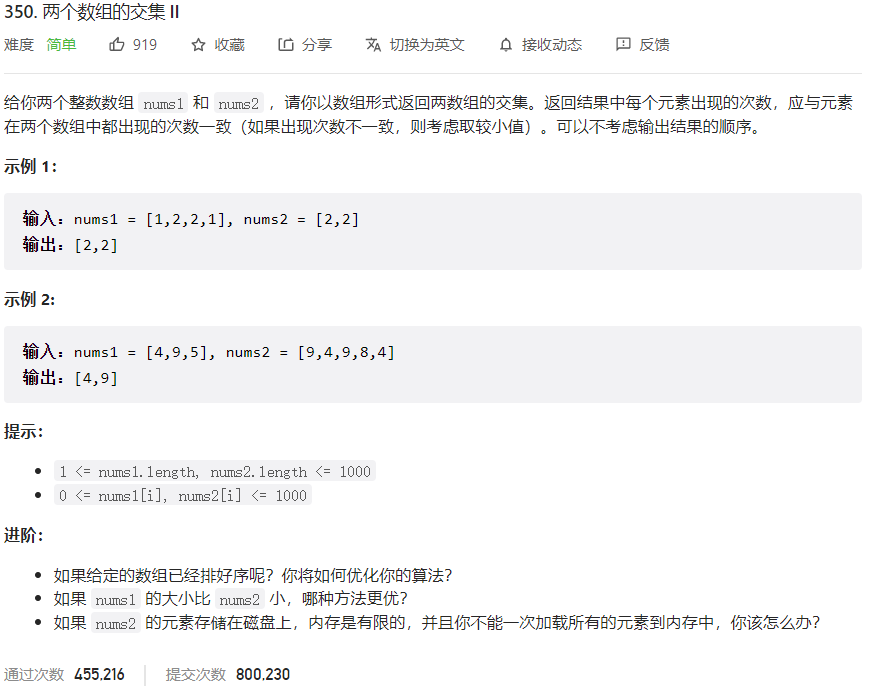



## 题目描述

> 🔥 [350. 两个数组的交集 II](https://leetcode.cn/problems/intersection-of-two-arrays-ii/)



## 思路分析

> 解法一：哈希表
> 使用哈希表记录一个数组中每个元素出现的次数，然后遍历另一个数组，如果当前元素在哈希表中出现次数大于 0，则将其加入结果数组中，并将哈希表中对应元素的出现次数减 1。

>解法二：排序+双指针
>先将两个数组排序，然后使用双指针分别指向两个数组的开头，比较两个指针指向的元素大小，如果相等，则将该元素加入结果数组中，并将两个指针都向后移动一位；如果不相等，则将较小的指针向后移动一位。

## 参考代码

```go
write your code here
```

<a class="button show-hidden">🍏 点击查看 Java 题解</a>

```java
write your code here
```

## 相似题目

| 题目                                                         | 难度   | 题解 |
| ------------------------------------------------------------ | ------ | ---- |
| [两个数组的交集](https://leetcode.cn/problems/intersection-of-two-arrays/) | Easy |      |
| [查找共用字符](https://leetcode.cn/problems/find-common-characters/) | Easy |      |
