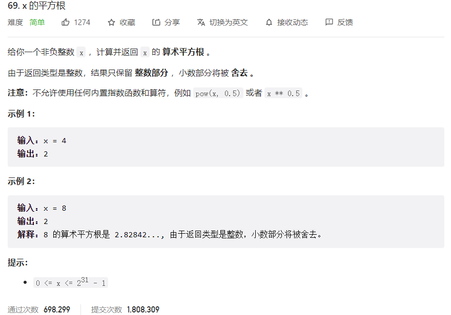



## 题目描述

> 🔥 [69. x 的平方根](https://leetcode.cn/problems/sqrtx/)



## 思路分析

> 二分查找

## 参考代码

```go
func mySqrt(x int) int {
	if x == 0 || x == 1 {
		return x
	}
	left, right := 1, x
	res := 0
	for left <= right {
		mid := left + (right-left)/2
		if mid > x/mid {
			right = mid - 1
		} else {
			res = mid
			left = mid + 1
		}
	}
	return res
}
```

<a class="button show-hidden">🍏 点击查看 Java 题解</a>

```java
class Solution {
    public int mySqrt(int x) {
        if (x == 0 || x == 1) {
            return x;
        }
        int left = 1, right = x;
        int res = 0;
        while (left <= right) {
            int mid = left + (right - left) / 2;
            if (mid > x / mid) {
                right = mid - 1;
            } else {
                res = mid;
                left = mid + 1;
            }
        }
        return res;
    }
}
```

## 相似题目

| 题目                                                         | 难度   | 题解 |
| ------------------------------------------------------------ | ------ | ---- |
| [Pow(x, n)](https://leetcode.cn/problems/powx-n/) | Medium |      |
| [有效的完全平方数](https://leetcode.cn/problems/valid-perfect-square/) | Easy |      |
