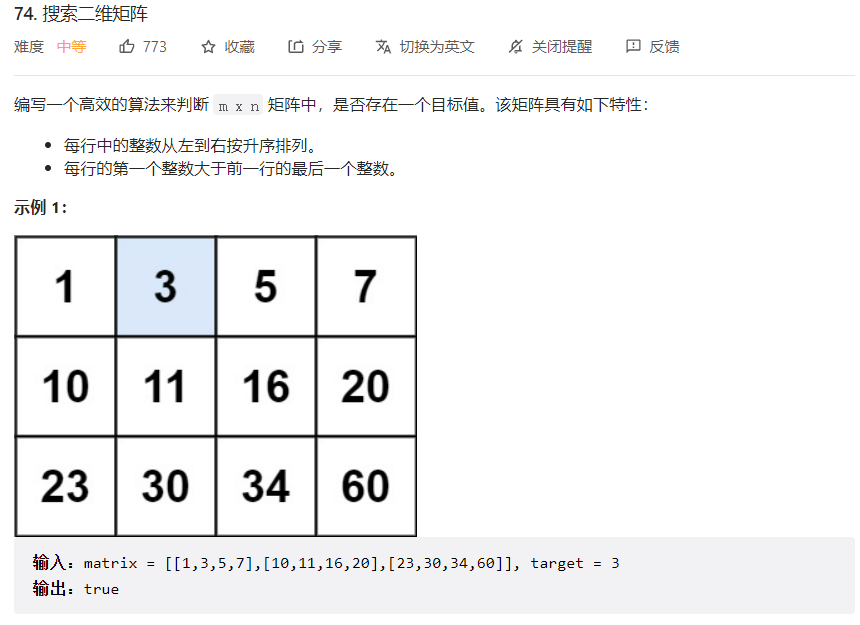
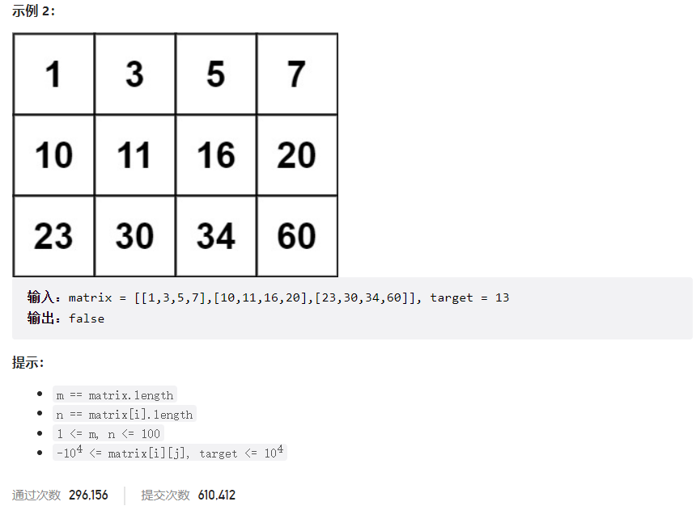



## 题目描述

> 🔥 [74. 搜索二维矩阵](https://leetcode.cn/problems/search-a-2d-matrix/)





## 思路分析

> 思路描述

## 参考代码

```go
func searchMatrix(matrix [][]int, target int) bool {
	m, n := len(matrix), len(matrix[0])
	left, right := 0, m*n-1
	for left <= right {
		mid := left + (right-left)/2
		cur := matrix[mid/n][mid%n]
		if cur == target {
			return true
		} else if cur > target {
			right = mid - 1
		} else {
			left = mid + 1
		}
	}
	return false
}
```

<a class="button show-hidden">🍏 点击查看 Java 题解</a>

```java
write your code here
```

## 相似题目

| 题目                                                         | 难度   | 题解 |
| ------------------------------------------------------------ | ------ | ---- |
| [搜索二维矩阵 II](https://leetcode.cn/problems/search-a-2d-matrix-ii/) | Medium |      |
