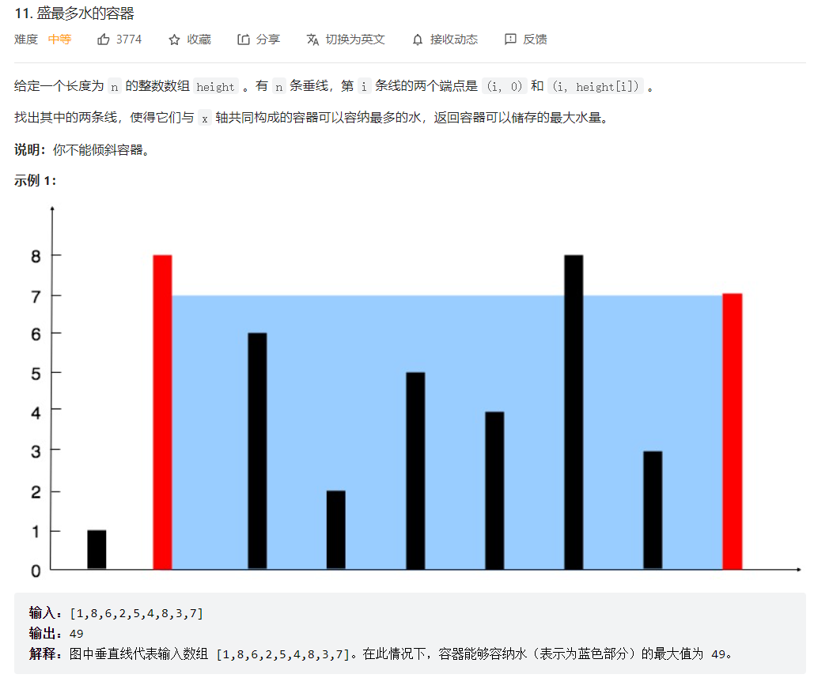
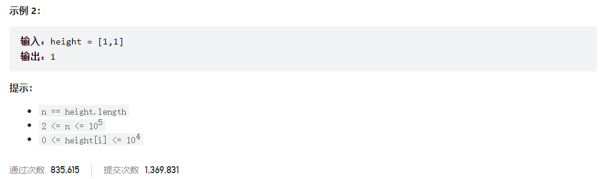



## 题目描述

> 🔥 [11. 盛最多水的容器](https://leetcode.cn/problems/container-with-most-water/)





## 思路分析

> 在每个状态下，无论长板或短板向中间收窄一格，都会导致水槽的底边宽度变短。
> 若向内**移动短板**，水槽的短板`min(h[i], h[j])`可能变大，因此下个水槽的面积**可能增大**。
> 若向内**移动长板**，水槽的短板`min(h[i], h[j])`不变或变小，因此下个水槽的面积**一定变小**。

> 解题思路：
>
> 1. 使用双指针法，一个指针从数组的开头开始，一个指针从数组的末尾开始。
> 2. 计算指针所指的两条线构成的容器的面积，面积等于两条线之间的距离乘以两条线中较短的线的高度。
> 3. 比较两条线中较短的线，将较短的线所在的指针向内移动一个位置，因为移动较长的线不会让容器的面积增大，而移动较短的线可能会使容器的面积增大。
> 4. 继续计算移动后两指针所指的容器的面积，更新最大面积。
> 5. 重复步骤 3 和步骤 4，直到两指针相遇。

## 参考代码

```go
func maxArea(height []int) int {
	left, right := 0, len(height)-1
	res := 0
	for left < right {
		if height[left] < height[right] {
			res = max(res, height[left]*(right-left))
			left++
		} else {
			res = max(res, height[right]*(right-left))
			right--
		}
	}
	return res
}

func max(a, b int) int {
	if a > b {
		return a
	}
	return b
}
```

<a class="button show-hidden">🍏 点击查看 Java 题解</a>

```java
class Solution {
    public int maxArea(int[] height) {
        int left = 0, right = height.length - 1;
        int res = 0;
        while (left < right) {
            if (height[left] < height[right]) {
                res = Math.max(res, height[left] * (right - left));
                left++;
            } else {
                res = Math.max(res, height[right] * (right - left));
                right--;
            }
        }
        return res;
    }
}
```

## 相似题目

| 题目                                                        | 难度 | 题解 |
| ----------------------------------------------------------- | ---- | ---- |
| [接雨水](https://leetcode.cn/problems/trapping-rain-water/) | Hard |      |
