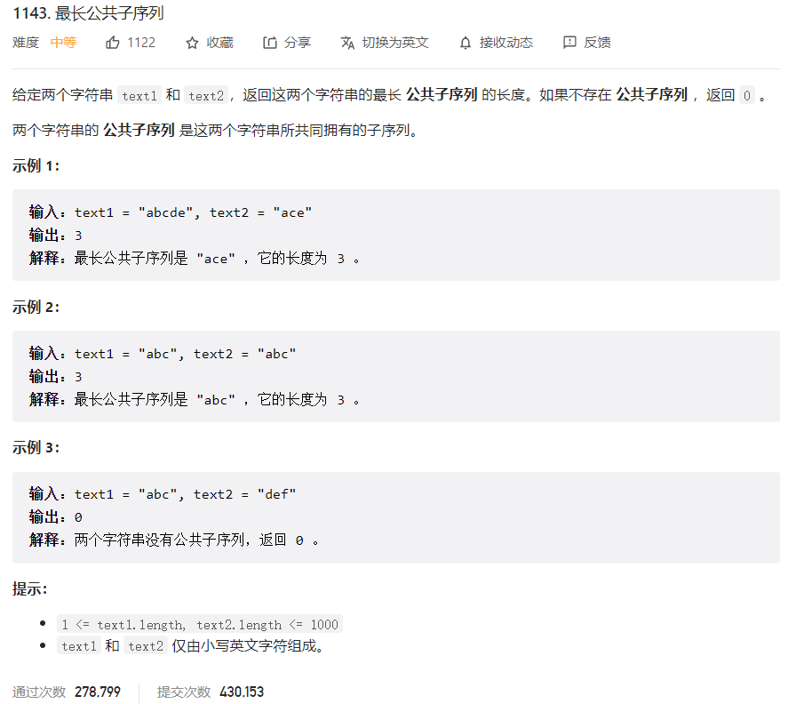



## 题目描述

> 🔥 [1143. 最长公共子序列](https://leetcode.cn/problems/longest-common-subsequence/)



## 思路分析

> `dp[i][j]`表示`text1[0:i]`和`text2[0:j]`最长公共子序列的长度

## 参考代码

```go
func longestCommonSubsequence(text1 string, text2 string) int {
	m, n := len(text1), len(text2)
	dp := make([][]int, m+1) //  dp[i][j] 表示 text1 的前 i 个字符与 text2 的前 j 个字符的最长公共子序列的长度
	for i := 0; i <= m; i++ {
		dp[i] = make([]int, n+1)
	}
	for i := 1; i <= m; i++ {
		for j := 1; j <= n; j++ {
			if text1[i-1] == text2[j-1] {
				dp[i][j] = dp[i-1][j-1] + 1
			} else {
				dp[i][j] = max(dp[i-1][j], dp[i][j-1])
			}
		}
	}
	return dp[m][n]
}

func max(a, b int) int {
	if a > b {
		return a
	}
	return b
}
```

<a class="button show-hidden">🍏 点击查看 Java 题解</a>

```java
class Solution {
    public int longestCommonSubsequence(String text1, String text2) {
        int m = text1.length();
        int n = text2.length();
        int[][] dp = new int[m + 1][n + 1];
        for (int i = 1; i <= m; i++) {
            for (int j = 1; j <= n; j++) {
                if (text1.charAt(i - 1) == text2.charAt(j - 1)) {
                    dp[i][j] = dp[i - 1][j - 1] + 1;
                } else {
                    dp[i][j] = Math.max(dp[i - 1][j], dp[i][j - 1]);
                }
            }
        }
        return dp[m][n];
    }
}
```

## 相似题目

| 题目                                                         | 难度   | 题解 |
| ------------------------------------------------------------ | ------ | ---- |
| [编辑距离](https://leetcode.cn/problems/edit-distance/)      | Hard   |      |
| [两个字符串的最小 ASCII 删除和](https://leetcode.cn/problems/minimum-ascii-delete-sum-for-two-strings/) | Medium |      |
| [两个字符串的删除操作](https://leetcode.cn/problems/delete-operation-for-two-strings/) | Medium |      |
| [不相交的线](https://leetcode.cn/problems/uncrossed-lines/)  | Medium |      |
