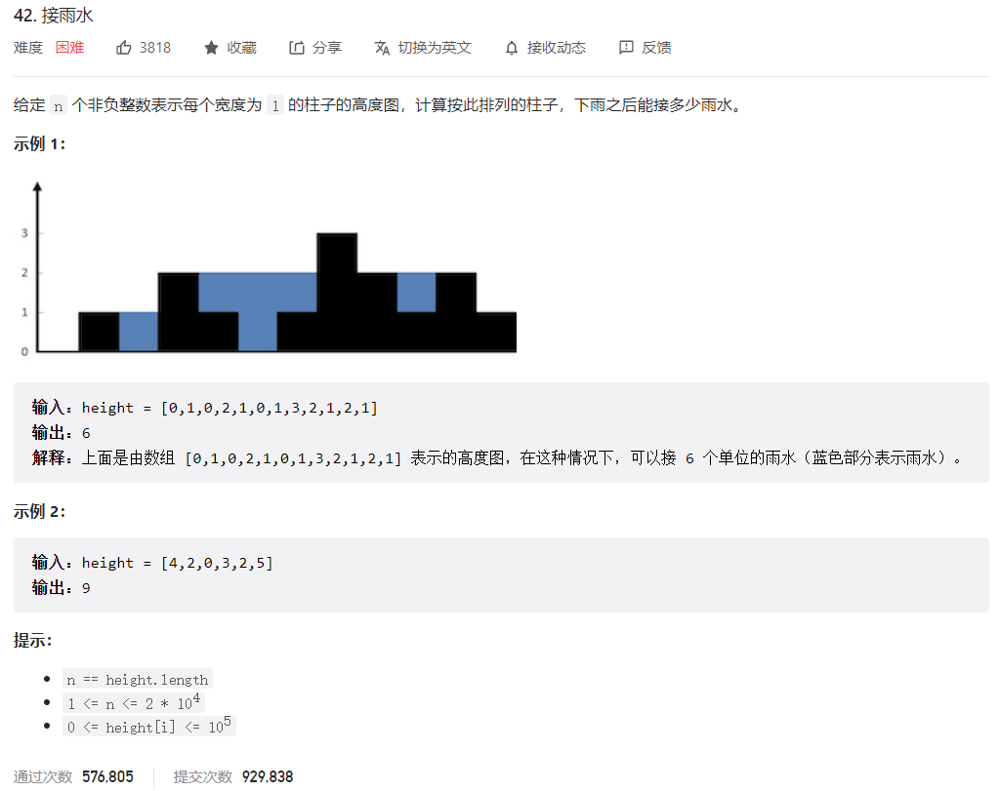



## 题目描述

> 🔥 [42. 接雨水](https://leetcode.cn/problems/trapping-rain-water/)



## 思路分析

> 单调栈
>
> 双指针

## 参考代码

```go
func trap(height []int) int {
	n := len(height)
	if n <= 2 {
		return 0
	}

	res := 0
	leftMax := make([]int, n)
	leftMax[0] = height[0]
	for i := 1; i < n; i++ {
		leftMax[i] = max(leftMax[i-1], height[i])
	}

	rightMax := make([]int, n)
	rightMax[n-1] = height[n-1]
	for i := n - 2; i >= 0; i-- {
		rightMax[i] = max(rightMax[i+1], height[i])
	}

	for i := 1; i < n-1; i++ {
		minHeight := min(leftMax[i], rightMax[i])
		res += max(0, minHeight-height[i])
	}
	return res
}

func max(a, b int) int {
	if a > b {
		return a
	}
	return b
}

func min(a, b int) int {
	if a < b {
		return a
	}
	return b
}
```

<a class="button show-hidden">🍏 点击查看 Java 题解</a>

```java
write your code here
```

## 相似题目

| 题目                                                         | 难度   | 题解 |
| ------------------------------------------------------------ | ------ | ---- |
| [盛最多水的容器](https://leetcode.cn/problems/container-with-most-water/) | Medium |      |
| [除自身以外数组的乘积](https://leetcode.cn/problems/product-of-array-except-self/) | Medium |      |
| [接雨水 II](https://leetcode.cn/problems/trapping-rain-water-ii/) | Hard |      |
| [倒水](https://leetcode.cn/problems/pour-water/) | Medium |      |
