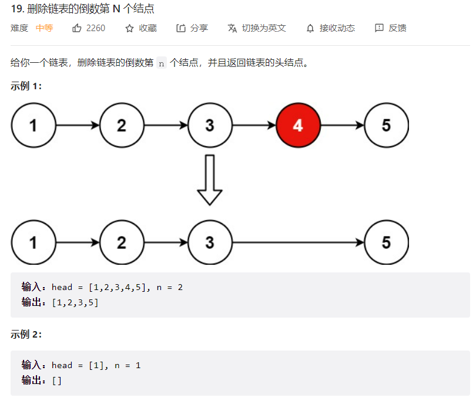
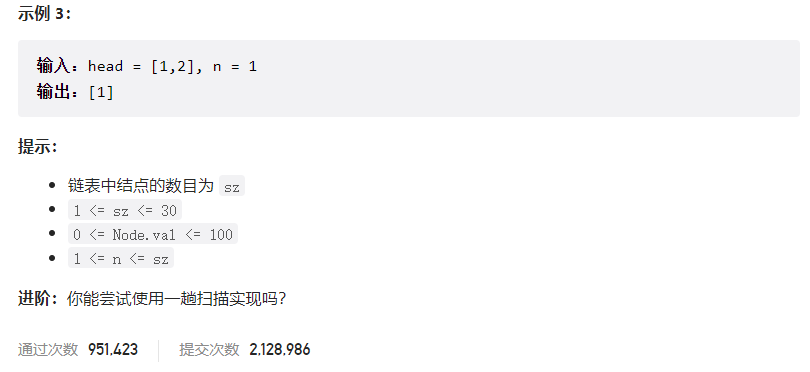



## 题目描述

> 🔥 [19. 删除链表的倒数第 N 个结点](https://leetcode.cn/problems/remove-nth-node-from-end-of-list/)





## 思路分析

> 快慢指针

## 参考代码

```go
func removeNthFromEnd(head *ListNode, n int) *ListNode {
	dummy := &ListNode{Next: head}
	slow, fast := dummy, dummy
	for i := 0; i < n; i++ {
		fast = fast.Next
	}
	for fast != nil && fast.Next != nil {
		fast = fast.Next
		slow = slow.Next
	}
	slow.Next = slow.Next.Next
	return dummy.Next
}
```

<a class="button show-hidden">🍏 点击查看 Java 题解</a>

```java
class Solution {
    public ListNode removeNthFromEnd(ListNode head, int n) {
        ListNode dummy = new ListNode();
        dummy.next = head;
        ListNode slow = dummy, fast = dummy;
        for (int i = 0; i < n; i++) {
            fast = fast.next;
        }
        while (fast != null && fast.next != null) {
            slow = slow.next;
            fast = fast.next;
        }
        slow.next = slow.next.next;
        return dummy.next;
    }
}
```
