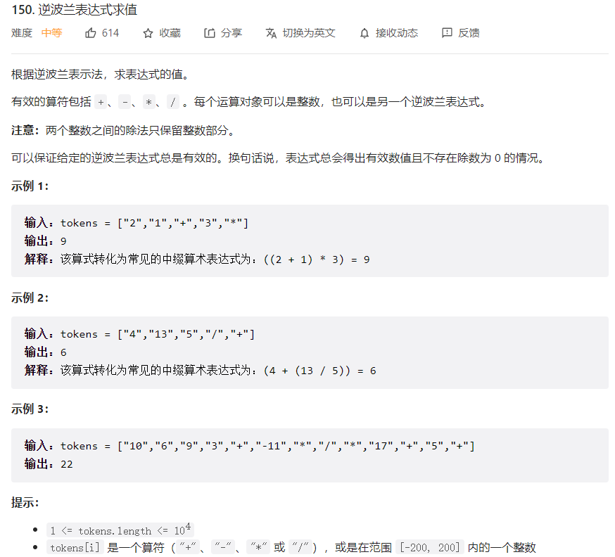



## 题目描述

> 🔥 [150. 逆波兰表达式求值](https://leetcode.cn/problems/evaluate-reverse-polish-notation/)



## 思路分析

> **注意：**两个整数之间的除法只保留整数部分
>
> 方法一：使用栈

## 参考代码

```go
func evalRPN(tokens []string) int {
	var stack []int
	for _, token := range tokens {
		if isOperator(token) {
			operand2 := stack[len(stack)-1]
			operand1 := stack[len(stack)-2]
			stack = stack[:len(stack)-2] // 弹出两个操作数
			result := performOperation(token, operand1, operand2)
			stack = append(stack, result)
		} else {
			num, _ := strconv.Atoi(token)
			stack = append(stack, num)
		}
	}
	return stack[0]
}

func isOperator(token string) bool {
	return token == "+" || token == "-" || token == "*" || token == "/"
}

func performOperation(operator string, operand1, operand2 int) int {
	switch operator {
	case "+":
		return operand1 + operand2
	case "-":
		return operand1 - operand2
	case "*":
		return operand1 * operand2
	case "/":
		return operand1 / operand2
	}
	return 0
}
```

<a class="button show-hidden">🍏 点击查看 Java 题解</a>

```java
write your code here
```

## 相似题目

| 题目                                                         | 难度   | 题解 |
| ------------------------------------------------------------ | ------ | ---- |
| [基本计算器](https://leetcode.cn/problems/basic-calculator/) | Hard |      |
| [给表达式添加运算符](https://leetcode.cn/problems/expression-add-operators/) | Hard |      |
