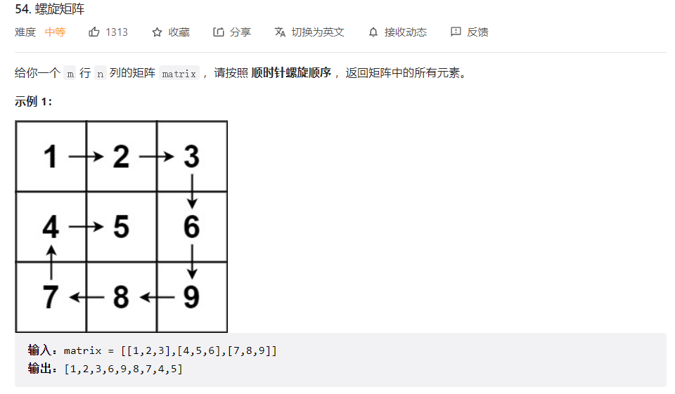
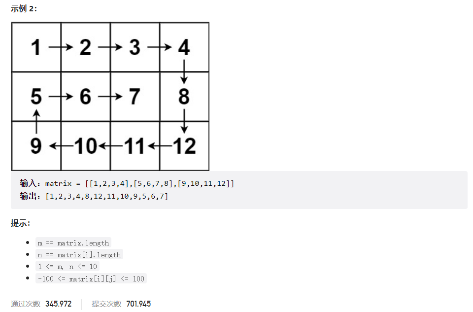



## 题目描述

> 🔥 [54. 螺旋矩阵](https://leetcode.cn/problems/spiral-matrix/)





## 思路分析

> 模拟

## 参考代码

```go
func spiralOrder(matrix [][]int) []int {
	var res []int
	if len(matrix) == 0 || len(matrix[0]) == 0 {
		return res
	}
	m, n := len(matrix)-1, len(matrix[0])-1
	rowBegin, rowEnd := 0, m
	colBegin, colEnd := 0, n
	for rowBegin <= rowEnd && colBegin <= colEnd {
		if rowBegin <= rowEnd {
			for j := colBegin; j <= colEnd; j++ {
				res = append(res, matrix[rowBegin][j])
			}
			rowBegin++
		}
		if colBegin <= colEnd {
			for i := rowBegin; i <= rowEnd; i++ {
				res = append(res, matrix[i][colEnd])
			}
			colEnd--
		}
		if rowBegin <= rowEnd {
			for j := colEnd; j >= colBegin; j-- {
				res = append(res, matrix[rowEnd][j])
			}
			rowEnd--
		}
		if colBegin <= colEnd {
			for i := rowEnd; i >= rowBegin; i-- {
				res = append(res, matrix[i][colBegin])
			}
			colBegin++
		}
	}
	return res
}
```

<a class="button show-hidden">🍏 点击查看 Java 题解</a>

```java
class Solution {
    public List<Integer> spiralOrder(int[][] matrix) {
        List<Integer> res = new ArrayList<>();
        int m = matrix.length;
        int n = matrix[0].length;
        int rowBegin = 0, rowEnd = m - 1;
        int colBegin = 0, colEnd = n - 1;

        while (rowBegin <= rowEnd && colBegin <= colEnd) {
            // 向右
            for (int j = colBegin; j <= colEnd; j++) {
                res.add(matrix[rowBegin][j]);
            }
            rowBegin++;

            // 向下
            for (int i = rowBegin; i <= rowEnd; i++) {
                res.add(matrix[i][colEnd]);
            }
            colEnd--;

            // 向左（检查是否需要继续）
            if (rowBegin <= rowEnd) {
                for (int j = colEnd; j >= colBegin; j--) {
                    res.add(matrix[rowEnd][j]);
                }
                rowEnd--;
            }

            // 向上（检查是否需要继续）
            if (colBegin <= colEnd) {
                for (int i = rowEnd; i >= rowBegin; i--) {
                    res.add(matrix[i][colBegin]);
                }
                colBegin++;
            }
        }
        return res;
    }
}
```

## 相似题目

| 题目                                                         | 难度   | 题解 |
| ------------------------------------------------------------ | ------ | ---- |
| [螺旋矩阵 II](https://leetcode.cn/problems/spiral-matrix-ii/) | Medium |      |
