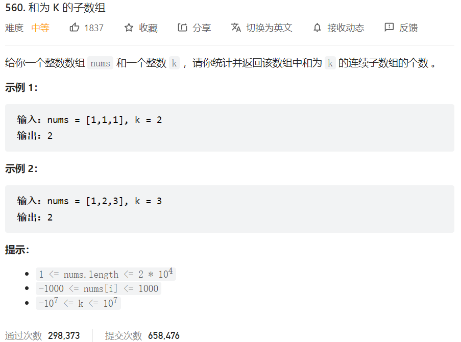



## 题目描述

> 🔥 [560. 和为 K 的子数组](https://leetcode.cn/problems/subarray-sum-equals-k/)



## 思路分析

> 前缀和+哈希表

## 参考代码

```go
func subarraySum(nums []int, k int) int {
	hashtable := make(map[int]int)
	hashtable[0] = 1
	res, total := 0, 0
	for _, num := range nums {
		total += num
		if count, ok := hashtable[total-k]; ok {
			res += count
		}
		hashtable[total]++
	}
	return res
}
```

<a class="button show-hidden">🍏 点击查看 Java 题解</a>

```java
class Solution {
    public int subarraySum(int[] nums, int k) {
        Map<Integer, Integer> map = new HashMap<>();
        map.put(0, 1);
        int total = 0;
        int res = 0;
        for (int num : nums) {
            total += num;
            res += map.getOrDefault(total - k, 0);
            map.put(total, map.getOrDefault(total, 0) + 1);
        }
        return res;
    }
}
```

## 相似题目

| 题目                                                         | 难度   | 题解 |
| ------------------------------------------------------------ | ------ | ---- |
| [两数之和](https://leetcode.cn/problems/two-sum/) | Easy |      |
| [连续的子数组和](https://leetcode.cn/problems/continuous-subarray-sum/) | Medium |      |
| [乘积小于 K 的子数组](https://leetcode.cn/problems/subarray-product-less-than-k/) | Medium |      |
| [寻找数组的中心下标](https://leetcode.cn/problems/find-pivot-index/) | Easy |      |
| [和可被 K 整除的子数组](https://leetcode.cn/problems/subarray-sums-divisible-by-k/) | Medium |      |
