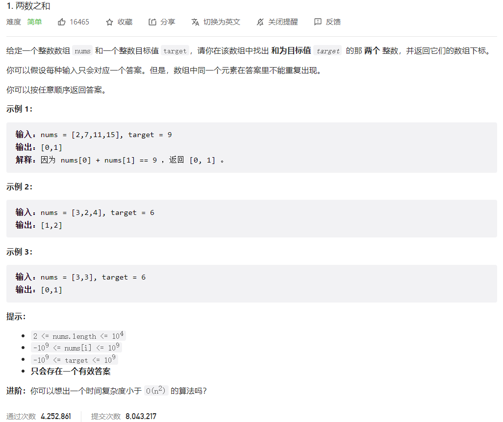



## 题目描述

> 🔥 [1. 两数之和](https://leetcode.cn/problems/two-sum/)



## 思路分析

> 哈希表

## 参考代码

```go
func twoSum(nums []int, target int) []int {
	hashtable := make(map[int]int)
	for i, num := range nums {
		if index, ok := hashtable[target-num]; ok {
			return []int{index, i}
		}
		hashtable[num] = i
	}
	return []int{-1, -1}
}
```

<a class="button show-hidden">🍏 点击查看 Java 题解</a>

```java
class Solution {
    public int[] twoSum(int[] nums, int target) {
        int[] res = {-1, -1};
        Map<Integer, Integer> map = new HashMap<>();
        for (int i = 0; i < nums.length; i++) {
            if (map.containsKey(target - nums[i])) {
                res[0] = map.get(target - nums[i]);
                res[1] = i;
                return res;
            }
            map.put(nums[i], i);
        }
        return res;
    }
}
```

## 相似题目

| 题目                                                         | 难度   | 题解 |
| ------------------------------------------------------------ | ------ | ---- |
| [三数之和](https://leetcode.cn/problems/3sum/) | Medium |      |
| [四数之和](https://leetcode.cn/problems/4sum/) | Medium |      |
| [两数之和 II - 输入有序数组](https://leetcode.cn/problems/two-sum-ii-input-array-is-sorted/) | Medium |      |
| [两数之和 III - 数据结构设计](https://leetcode.cn/problems/two-sum-iii-data-structure-design/) | Easy |      |
| [和为 K 的子数组](https://leetcode.cn/problems/subarray-sum-equals-k/) | Medium |      |
| [两数之和 IV - 输入二叉搜索树](https://leetcode.cn/problems/two-sum-iv-input-is-a-bst/) | Easy |      |
| [小于 K 的两数之和](https://leetcode.cn/problems/two-sum-less-than-k/) | Easy |      |
