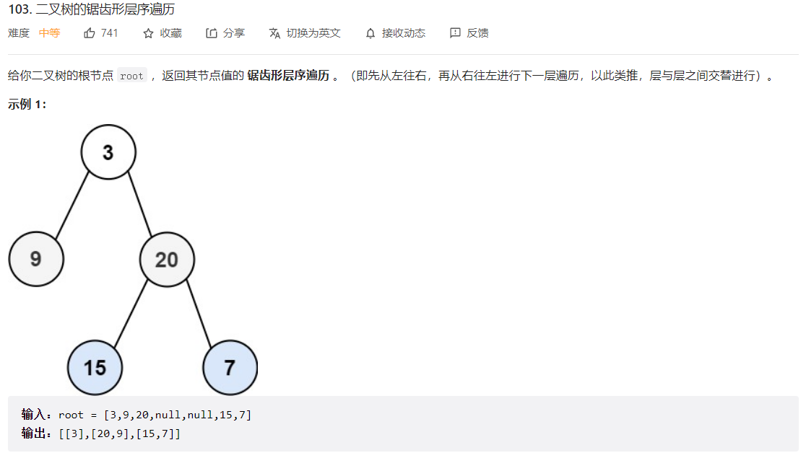
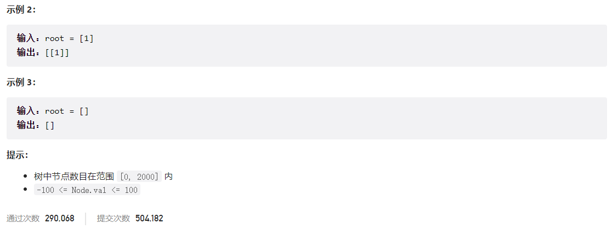



## 题目描述

> 🔥 [103. 二叉树的锯齿形层序遍历](https://leetcode.cn/problems/binary-tree-zigzag-level-order-traversal/)





## 思路分析

> 层序遍历

## 参考代码

```go
func zigzagLevelOrder(root *TreeNode) [][]int {
	res := make([][]int, 0)
	if root == nil {
		return res
	}
	queue := []*TreeNode{root}
	odd := false
	for len(queue) > 0 {
		level, size := make([]int, 0), len(queue)
		for i := 0; i < size; i++ {
			node := queue[0]
			level = append(level, node.Val)
			queue = queue[1:]
			if node.Left != nil {
				queue = append(queue, node.Left)
			}
			if node.Right != nil {
				queue = append(queue, node.Right)
			}
		}
		if odd {
			for i, j := 0, len(level)-1; i < j; i, j = i+1, j-1 {
				level[i], level[j] = level[j], level[i]
			}
		}
		odd = !odd
		res = append(res, level)
	}
	return res
}
```

```go
func zigzagLevelOrder(root *TreeNode) [][]int {
	if root == nil {
		return nil
	}
	var res [][]int
	queue := []*TreeNode{root}
	odd := false
	for len(queue) > 0 {
		size := len(queue)
		level := make([]int, size)
		for i := 0; i < size; i++ {
			index := i
			if odd {
				index = size - 1 - i
			}
			node := queue[i]
			level[index] = node.Val
			if node.Left != nil {
				queue = append(queue, node.Left)
			}
			if node.Right != nil {
				queue = append(queue, node.Right)
			}
		}
		queue = queue[size:]
		res = append(res, level)
		odd = !odd
	}
	return res
}
```

<a class="button show-hidden">🍏 点击查看 Java 题解</a>

```java
class Solution {
    public List<List<Integer>> zigzagLevelOrder(TreeNode root) {
        List<List<Integer>> res = new ArrayList<>();
        if (root == null) {
            return res;
        }
        Queue<TreeNode> queue = new LinkedList<>();
        queue.offer(root);
        boolean odd = false;
        while (!queue.isEmpty()) {
            List<Integer> level = new ArrayList<>();
            int size = queue.size();
            for (int i = 0; i < size; i++) {
                TreeNode node = queue.poll();
                if (odd) {
                    level.add(0, node.val);
                } else {
                    level.add(node.val);
                }
                if (node.left != null) {
                    queue.offer(node.left);
                }
                if (node.right != null) {
                    queue.offer(node.right);
                }
            }
            odd = !odd;
            res.add(level);
        }
        return res;
    }
}
```

## 相似题目

| 题目                                                         | 难度   | 题解                                        |
| ------------------------------------------------------------ | ------ | ------------------------------------------- |
| [二叉树的层序遍历](https://leetcode.cn/problems/binary-tree-level-order-traversal/) | Medium | [🟢](https://hgnulb.github.io/blog/87203213) |
