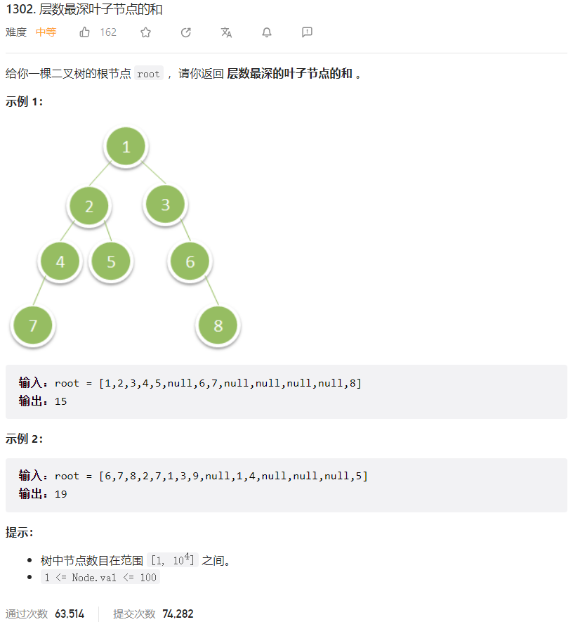



## 题目描述

> 🔥 [1302. 层数最深叶子节点的和](https://leetcode.cn/problems/deepest-leaves-sum/)



## 思路分析

> 层序遍历

## 参考代码

```go
write your code here
```

<a class="button show-hidden">🍏 点击查看 Java 题解</a>

```java
write your code here
```
