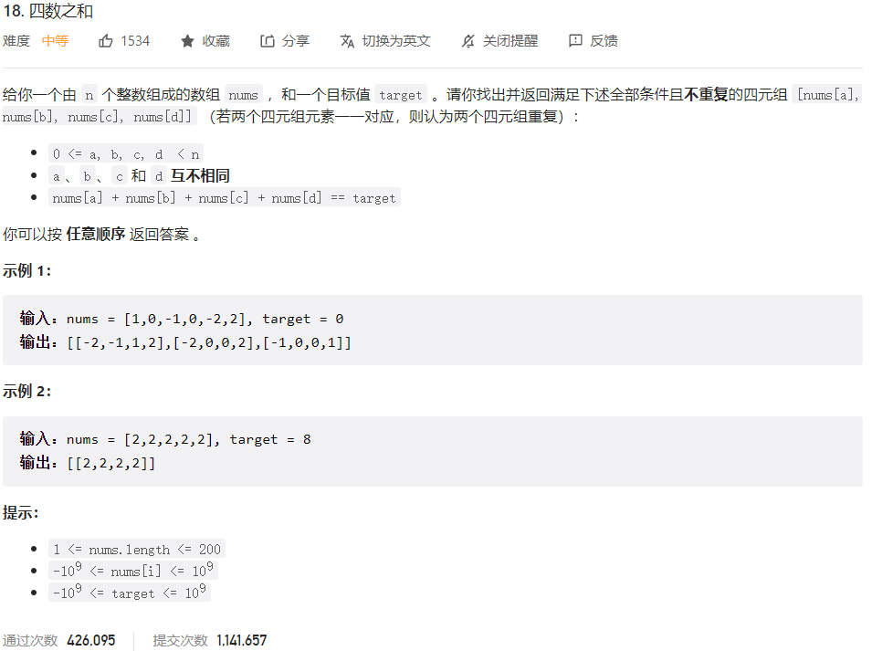



## 题目描述

> 🔥 [18. 四数之和](https://leetcode.cn/problems/4sum/)



## 思路分析

> 排序+双指针

## 参考代码

```go
func fourSum(nums []int, target int) [][]int {
	n := len(nums)
	if n < 4 {
		return nil
	}
	sort.Ints(nums)
	var res [][]int
	for i := 0; i < n-3; i++ {
		if i > 0 && nums[i] == nums[i-1] {
			continue
		}
		for j := i + 1; j < n-2; j++ {
			if j > i+1 && nums[j] == nums[j-1] {
				continue
			}
			left, right := j+1, n-1
			for left < right {
				sum := nums[i] + nums[j] + nums[left] + nums[right]
				if sum == target {
					res = append(res, []int{nums[i], nums[j], nums[left], nums[right]})
					left++
					right--
					for left < right && nums[left] == nums[left-1] {
						left++
					}
					for left < right && nums[right] == nums[right+1] {
						right--
					}
				} else if sum < target {
					left++
				} else {
					right--
				}
			}
		}
	}
	return res
}
```

<a class="button show-hidden">🍏 点击查看 Java 题解</a>

```java
write your code here
```

## 相似题目

| 题目                                                         | 难度   | 题解 |
| ------------------------------------------------------------ | ------ | ---- |
| [两数之和](https://leetcode.cn/problems/two-sum/) | Easy |      |
| [三数之和](https://leetcode.cn/problems/3sum/) | Medium |      |
| [四数相加 II](https://leetcode.cn/problems/4sum-ii/) | Medium |      |
