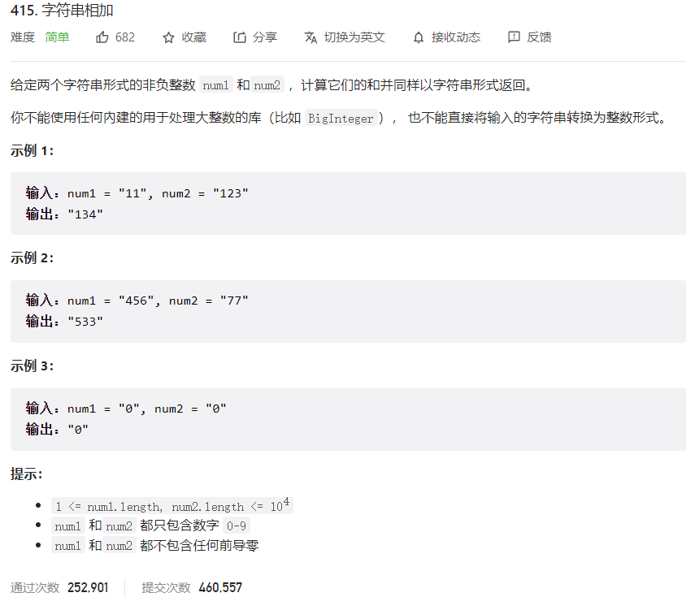



## 题目描述

> 🔥 [415. 字符串相加](https://leetcode.cn/problems/add-strings/)



## 思路分析

> 加法问题

## 参考代码

```go
func addStrings(num1 string, num2 string) string {
	p1, p2 := len(num1)-1, len(num2)-1
	carry := 0
	res := ""
	for p1 >= 0 || p2 >= 0 || carry > 0 {
		sum := carry
		if p1 >= 0 {
			sum += int(num1[p1] - '0')
			p1--
		}
		if p2 >= 0 {
			sum += int(num2[p2] - '0')
			p2--
		}
		res = strconv.Itoa(sum%10) + res
		carry = sum / 10
	}
	return res
}
```

<a class="button show-hidden">🍏 点击查看 Java 题解</a>

```java
class Solution {
    public String addStrings(String num1, String num2) {
        StringBuilder res = new StringBuilder();
        int p1 = num1.length() - 1;
        int p2 = num2.length() - 1;
        int carry = 0;
        while (p1 >= 0 || p2 >= 0 || carry > 0) {
            int total = carry;
            if (p1 >= 0) {
                total += num1.charAt(p1) - '0';
                p1--;
            }
            if (p2 >= 0) {
                total += num2.charAt(p2) - '0';
                p2--;
            }
            carry = total / 10;
            res.insert(0, total % 10);
        }
        return res.toString();
    }
}
```

## 相似题目

| 题目                                                         | 难度   | 题解 |
| ------------------------------------------------------------ | ------ | ---- |
| [两数相加](https://leetcode.cn/problems/add-two-numbers/) | Medium |      |
| [字符串相乘](https://leetcode.cn/problems/multiply-strings/) | Medium |      |
| [数组形式的整数加法](https://leetcode.cn/problems/add-to-array-form-of-integer/) | Easy |      |
