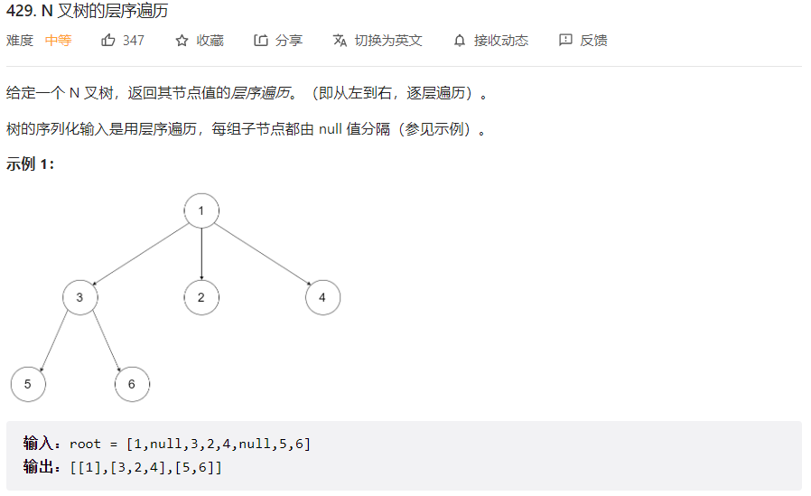
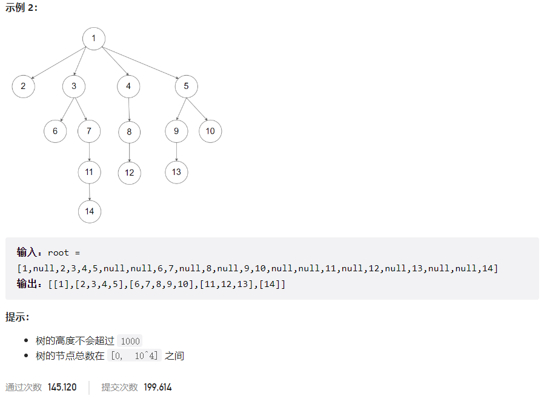



## 题目描述

> 🔥 [429. N 叉树的层序遍历](https://leetcode.cn/problems/n-ary-tree-level-order-traversal/)





## 思路分析

> 层序遍历

## 参考代码

```go
func levelOrder(root *Node) [][]int {
	res := make([][]int, 0)
	if root == nil {
		return res
	}
	queue := []*Node{root}
	for len(queue) > 0 {
		level, size := make([]int, 0), len(queue)
		for i := 0; i < size; i++ {
			node := queue[0]
			level = append(level, node.Val)
			queue = queue[1:]
			queue = append(queue, node.Children...)
		}
		res = append(res, level)
	}
	return res
}
```

<a class="button show-hidden">🍏 点击查看 Java 题解</a>

```java
write your code here
```

## 相似题目

| 题目                                                         | 难度   | 题解 |
| ------------------------------------------------------------ | ------ | ---- |
| [二叉树的层序遍历](https://leetcode.cn/problems/binary-tree-level-order-traversal/) | Medium |      |
| [N 叉树的前序遍历](https://leetcode.cn/problems/n-ary-tree-preorder-traversal/) | Easy |      |
| [N 叉树的后序遍历](https://leetcode.cn/problems/n-ary-tree-postorder-traversal/) | Easy |      |
