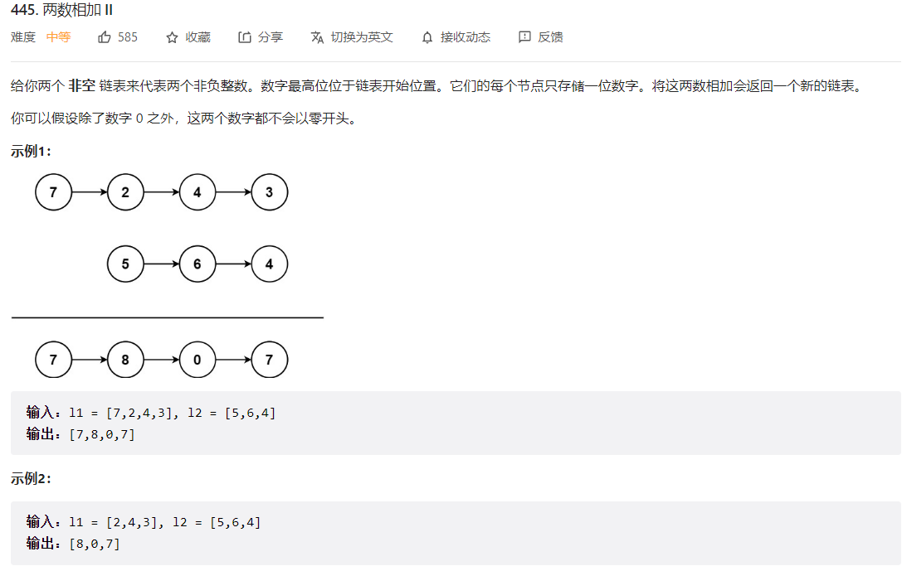
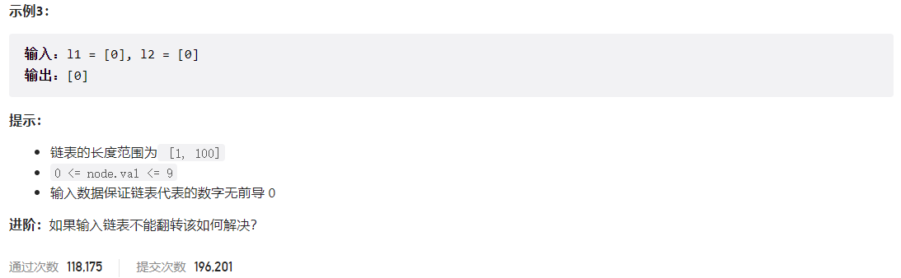



## 题目描述

> 🔥 [445. 两数相加 II](https://leetcode.cn/problems/add-two-numbers-ii/)





## 思路分析

> 加法问题

## 参考代码

```go
func addTwoNumbers(l1 *ListNode, l2 *ListNode) *ListNode {
	if l1 == nil {
		return l2
	} else if l2 == nil {
		return l1
	}
	l1, l2 = reverse(l1), reverse(l2)
	var pre *ListNode
	carry := 0
	for l1 != nil || l2 != nil || carry > 0 {
		sum := carry
		if l1 != nil {
			sum += l1.Val
			l1 = l1.Next
		}
		if l2 != nil {
			sum += l2.Val
			l2 = l2.Next
		}
		carry = sum / 10
		cur := &ListNode{Val: sum % 10}
		cur.Next = pre
		pre = cur
	}
	return pre
}

func reverse(head *ListNode) *ListNode {
	if head == nil || head.Next == nil {
		return head
	}
	var pre *ListNode
	cur := head
	for cur != nil {
		node := cur.Next
		cur.Next = pre
		pre = cur
		cur = node
	}
	return pre
}
```

```go
func addTwoNumbers(l1 *ListNode, l2 *ListNode) *ListNode {
	if l1 == nil {
		return l2
	} else if l2 == nil {
		return l1
	}
	stack1, stack2 := make([]int, 0), make([]int, 0)
	for l1 != nil {
		stack1 = append(stack1, l1.Val)
		l1 = l1.Next
	}
	for l2 != nil {
		stack2 = append(stack2, l2.Val)
		l2 = l2.Next
	}
	var pre *ListNode
	carry := 0
	for len(stack1) > 0 || len(stack2) > 0 || carry > 0 {
		sum := carry
		if len(stack1) > 0 {
			sum += stack1[len(stack1)-1]
			stack1 = stack1[:len(stack1)-1]
		}
		if len(stack2) > 0 {
			sum += stack2[len(stack2)-1]
			stack2 = stack2[:len(stack2)-1]
		}
		carry = sum / 10
		cur := &ListNode{Val: sum % 10}
		cur.Next = pre
		pre = cur
	}
	return pre
}
```

<a class="button show-hidden">🍏 点击查看 Java 题解</a>

```java
class Solution {
    public ListNode addTwoNumbers(ListNode l1, ListNode l2) {
        if (l1 == null) {
            return l2;
        } else if (l2 == null) {
            return l1;
        }
        l1 = reverseList(l1);
        l2 = reverseList(l2);
        ListNode pre = null;
        int carry = 0;
        while (l1 != null || l2 != null || carry > 0) {
            int twoSum = carry;
            if (l1 != null) {
                twoSum += l1.val;
                l1 = l1.next;
            }
            if (l2 != null) {
                twoSum += l2.val;
                l2 = l2.next;
            }
            carry = twoSum / 10;
            ListNode cur = new ListNode(twoSum % 10);
            cur.next = pre;
            pre = cur;
        }
        return pre;
    }

    public ListNode reverseList(ListNode head) {
        if (head == null || head.next == null) {
            return head;
        }
        ListNode pre = null, cur = head;
        while (cur != null) {
            ListNode next = cur.next;
            cur.next = pre;
            pre = cur;
            cur = next;
        }
        return pre;
    }
}
```

## 相似题目

| 题目                                                      | 难度   | 题解 |
| --------------------------------------------------------- | ------ | ---- |
| [两数相加](https://leetcode.cn/problems/add-two-numbers/) | Medium |      |
| [链表中的两数相加](https://leetcode.cn/problems/lMSNwu/)  | Medium |      |
