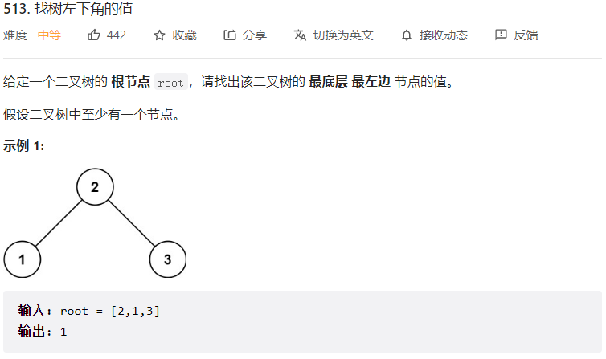
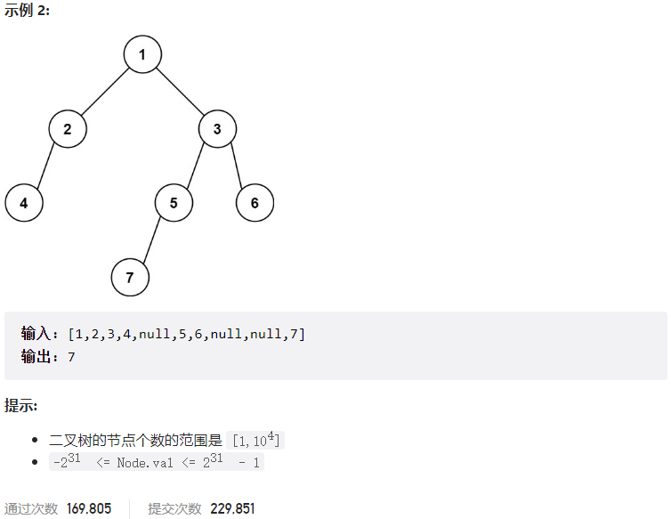



## 题目描述

> 🔥 [513. 找树左下角的值](https://leetcode.cn/problems/find-bottom-left-tree-value/)





## 思路分析

> 层序遍历

## 参考代码

```go
func findBottomLeftValue(root *TreeNode) int {
	var res int
	queue := []*TreeNode{root}
	for len(queue) > 0 {
		size := len(queue)
		for i := 0; i < size; i++ {
			node := queue[i]
			if i == 0 {
				res = node.Val
			}
			if node.Left != nil {
				queue = append(queue, node.Left)
			}
			if node.Right != nil {
				queue = append(queue, node.Right)
			}
		}
		queue = queue[size:]
	}
	return res
}
```

<a class="button show-hidden">🍏 点击查看 Java 题解</a>

```java
write your code here
```
