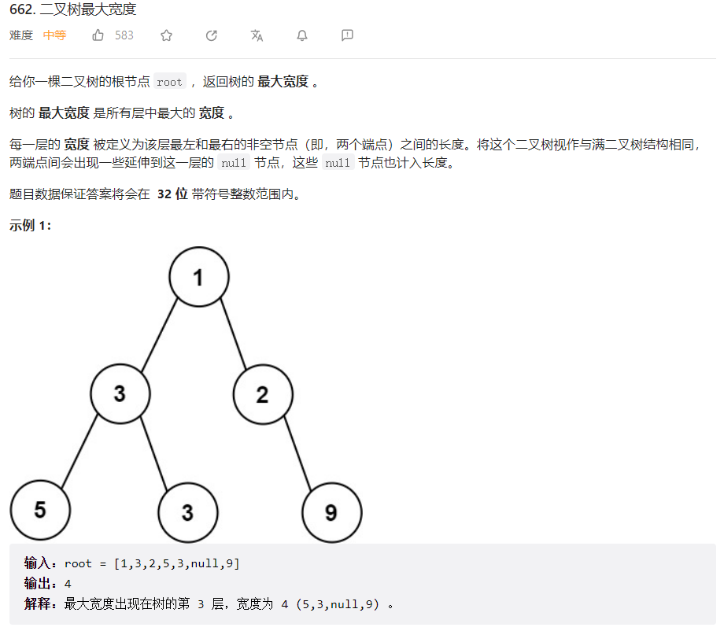
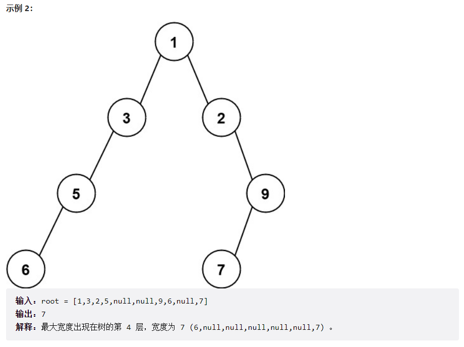
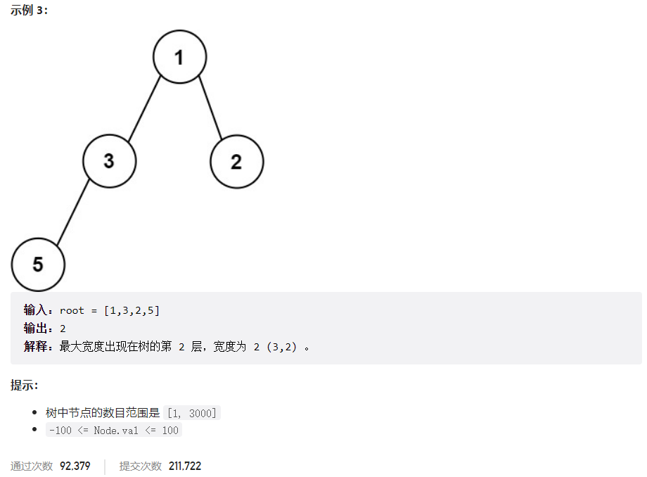



## 题目描述

> 🔥 [662. 二叉树最大宽度](https://leetcode.cn/problems/maximum-width-of-binary-tree/)







## 思路分析

> 层序遍历

## 参考代码

```go
func widthOfBinaryTree(root *TreeNode) int {
	if root == nil {
		return 0
	}
	res := 0
	root.Val = 1
	queue := []*TreeNode{root}
	for len(queue) > 0 {
		size := len(queue)
		first, last := 0, 0
		for i := 0; i < size; i++ {
			node := queue[0]
			if i == 0 {
				first = node.Val
			}
			if i == size-1 {
				last = node.Val
			}
			queue = queue[1:]
			if node.Left != nil {
				node.Left.Val = node.Val*2 - 1
				queue = append(queue, node.Left)
			}
			if node.Right != nil {
				node.Right.Val = node.Val * 2
				queue = append(queue, node.Right)
			}
		}
		res = max(res, last-first+1)
	}
	return res
}

func max(a, b int) int {
	if a > b {
		return a
	}
	return b
}
```

<a class="button show-hidden">🍏 点击查看 Java 题解</a>

```java
class Solution {
    public int widthOfBinaryTree(TreeNode root) {
        int res = 0;
        if (root == null) {
            return res;
        }
        Queue<TreeNode> queue = new LinkedList<>();
        root.val = 1;
        queue.offer(root);
        while (!queue.isEmpty()) {
            int size = queue.size();
            int start = 0, end = 0;
            for (int i = 0; i < size; i++) {
                TreeNode node = queue.poll();
                if (i == 0) {
                    start = node.val;
                }
                if (i == size - 1) {
                    end = node.val;
                }
                if (node.left != null) {
                    node.left.val = node.val * 2 - 1;
                    queue.offer(node.left);
                }
                if (node.right != null) {
                    node.right.val = node.val * 2;
                    queue.offer(node.right);
                }
            }
            res = Math.max(res, end - start + 1);
        }
        return res;
    }
}
```
