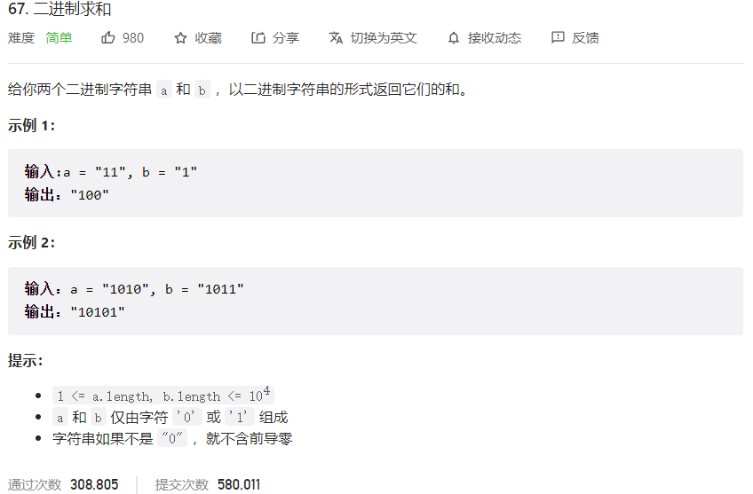



## 题目描述

> 🔥 [67. 二进制求和](https://leetcode.cn/problems/add-binary/)



## 思路分析

> 加法问题
>
> 解法一：模拟竖式加法
> 解法二：使用 zip_longest 函数和列表推导式

## 参考代码

```go
write your code here
```

<a class="button show-hidden">🍏 点击查看 Java 题解</a>

```java
write your code here
```

## 相似题目

| 题目                                                         | 难度   | 题解 |
| ------------------------------------------------------------ | ------ | ---- |
| [两数相加](https://leetcode.cn/problems/add-two-numbers/) | Medium |      |
| [字符串相乘](https://leetcode.cn/problems/multiply-strings/) | Medium |      |
| [加一](https://leetcode.cn/problems/plus-one/) | Easy |      |
| [数组形式的整数加法](https://leetcode.cn/problems/add-to-array-form-of-integer/) | Easy |      |
