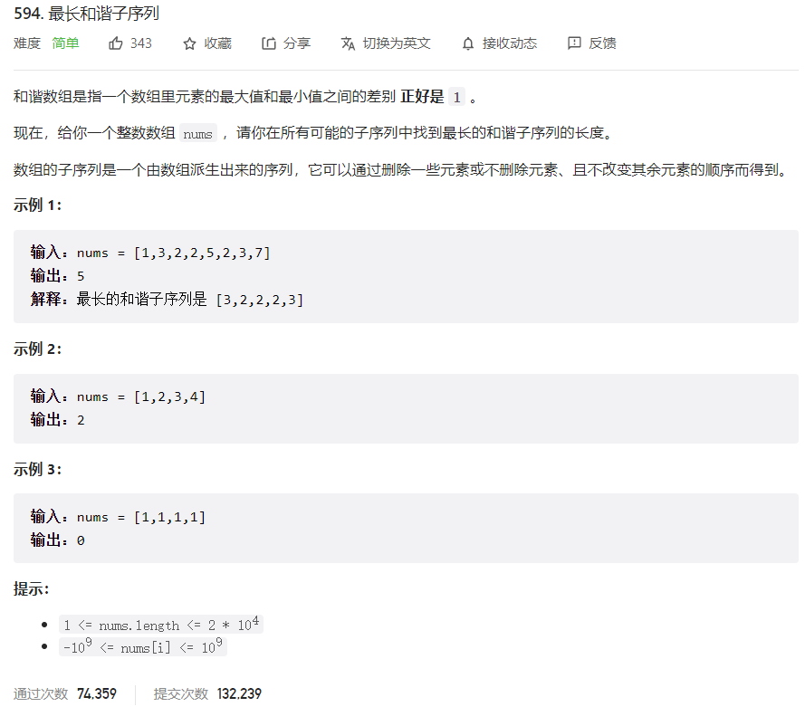



## 题目描述

> 🔥 [594. 最长和谐子序列](https://leetcode.cn/problems/longest-harmonious-subsequence/)



## 思路分析

> 思路描述

## 参考代码

```go
func findLHS(nums []int) int {
	countMap := make(map[int]int)
	// 统计数字出现的次数
	for _, num := range nums {
		countMap[num]++
	}
	maxLen := 0
	// 遍历map，查找和谐子序列的最大长度
	for num, count := range countMap {
		if nextCount, ok := countMap[num+1]; ok {
			curLen := count + nextCount
			if curLen > maxLen {
				maxLen = curLen
			}
		}
	}
	return maxLen
}
```

<a class="button show-hidden">🍏 点击查看 Java 题解</a>

```java
write your code here
```
