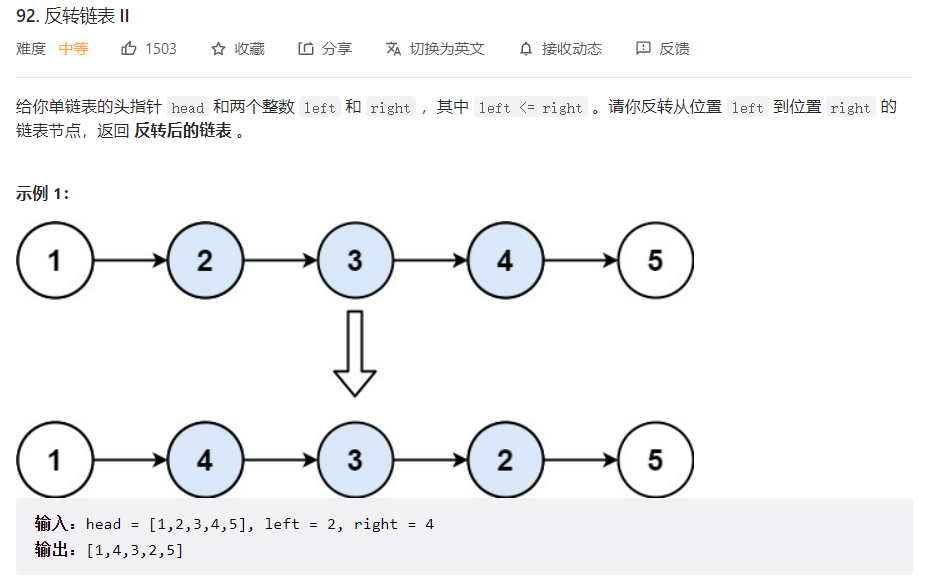
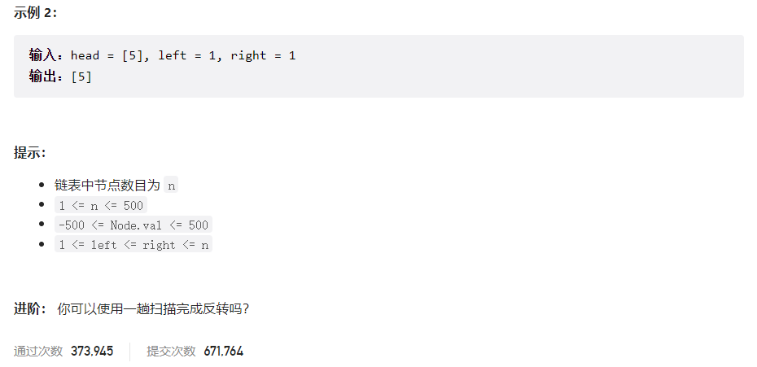



## 题目描述

> 🔥 [92. 反转链表 II](https://leetcode.cn/problems/reverse-linked-list-ii/)





## 思路分析

> 1. 找到反转链表的起始节点的前一个节点
> 2. 反转指定区间的链表
> 3. 连接左右两部分

## 参考代码

```go
func reverseBetween(head *ListNode, left int, right int) *ListNode {
	if head == nil || head.Next == nil || left == right {
		return head
	}

	dummy := &ListNode{Next: head} // 创建虚拟头节点
	first := dummy

	// 移动 first 指针到需要反转部分的前一个节点
	for i := 1; i < left; i++ {
		first = first.Next
	}

	var pre *ListNode
	cur := first.Next

	// 反转从 left 到 right 的节点
	for i := left; i <= right; i++ {
		next := cur.Next
		cur.Next = pre
		pre = cur
		cur = next
	}

	// 将反转后的部分连接回原链表
	first.Next.Next = cur
	first.Next = pre

	return dummy.Next // 返回虚拟头节点的下一个节点，即反转后的链表头节点
}
```

<a class="button show-hidden">🍏 点击查看 Java 题解</a>

```java
class Solution {
    public ListNode reverseBetween(ListNode head, int left, int right) {
        if (head == null || head.next == null || left >= right) {
            return head;
        }
        ListNode dummy = new ListNode();
        dummy.next = head;
        ListNode start = dummy;

        for (int i = 1; i < left; i++) {
            start = start.next;
        }

        ListNode pre = null, cur = start.next;
        for (int i = left; i <= right; i++) {
            ListNode next = cur.next;
            cur.next = pre;
            pre = cur;
            cur = next;
        }

        start.next.next = cur;
        start.next = pre;
        return dummy.next;
    }
}
```

## 相似题目

| 题目                                                         | 难度   | 题解 |
| ------------------------------------------------------------ | ------ | ---- |
| [反转链表](https://leetcode.cn/problems/reverse-linked-list/) | Easy |      |
