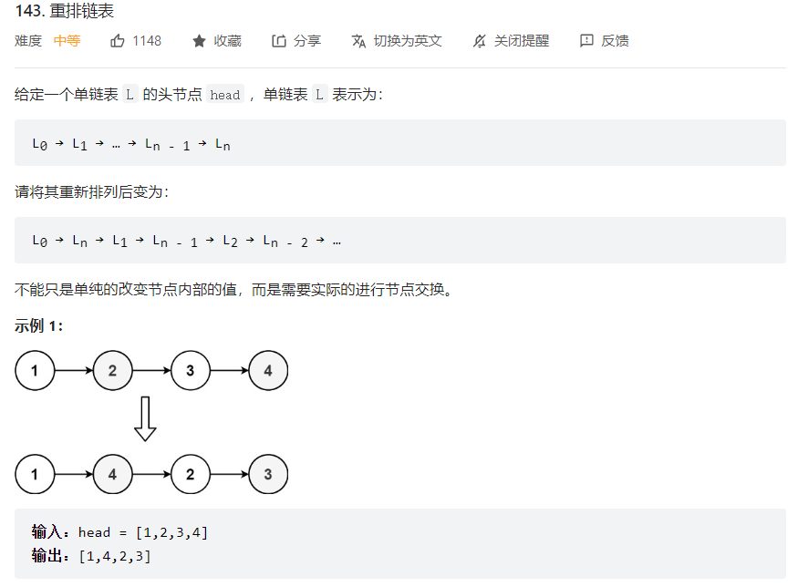
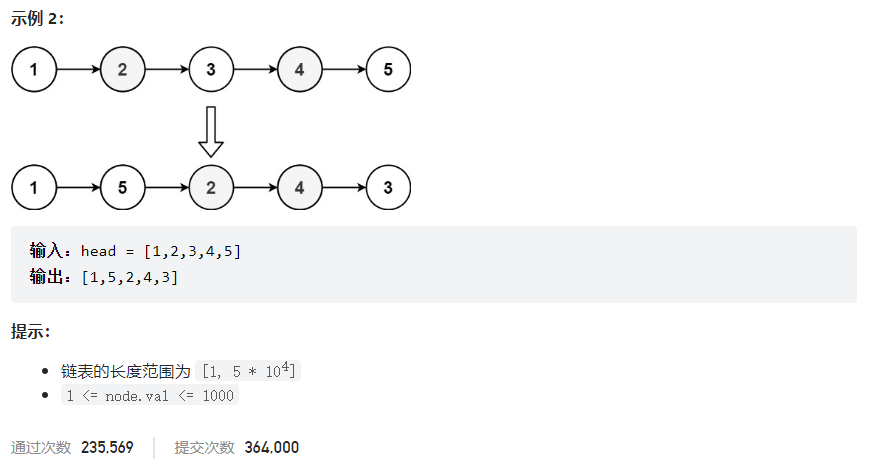



## 题目描述

> 🔥 [143. 重排链表](https://leetcode.cn/problems/reorder-list/)





## 思路分析

> 1. 获取链表的中间节点 slow(如果链表的长度为偶数，有两个中间结点，则返回第一个中间结点。)
> 2. 从中间节点的下一个节点开始反转后半部分链表, 反转后 pre 为新链表的头节点
> 3. 合并两个链表

## 参考代码

```go
func reorderList(head *ListNode) {
	if head == nil || head.Next == nil {
		return
	}
	
	slow, fast := head, head
	for fast != nil && fast.Next != nil {
		slow = slow.Next
		fast = fast.Next.Next
	}

	var pre *ListNode
	cur := slow.Next
	for cur != nil {
		next := cur.Next
		cur.Next = pre
		pre = cur
		cur = next
	}

	slow.Next = nil
	p1, p2 := head, pre
	for p2 != nil {
		next1, next2 := p1.Next, p2.Next
		p1.Next = p2
		p2.Next = next1
		p1 = next1
		p2 = next2
	}
}
```

<a class="button show-hidden">🍏 点击查看 Java 题解</a>

```java
write your code here
```
